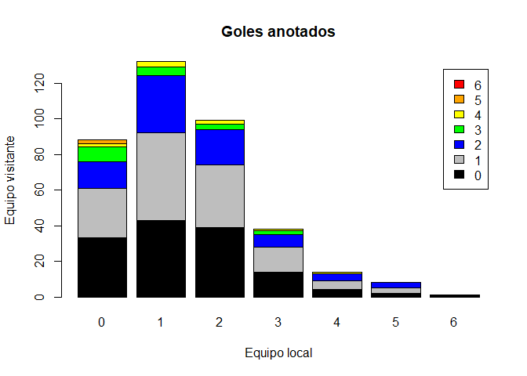

Programación y estadística con R Santander 2022
================
Equipo 19,
October 14th, 2022


## Introducción a R y Software

El siguiente postwork, te servirá para ir desarrollando habilidades como
si se tratara de un proyecto que evidencie el progreso del aprendizaje
durante el módulo, sesión a sesión se irá desarrollando. A continuación
aparecen una serie de objetivos que deberás cumplir, es un ejemplo real
de aplicación y tiene que ver con datos referentes a equipos de la liga
española de fútbol (recuerda que los datos provienen siempre de diversas
naturalezas), en este caso se cuenta con muchos datos que se pueden
aprovechar explotarlos y generar análisis interesantes que se pueden
aplicar a otras áreas. Siendo así damos paso a las instrucciones:

**1. Importa los datos de soccer de la temporada 2019/2020 de la primera
división de la liga española a R, los datos los puedes encontrar en el
siguiente enlace: <https://www.football-data.co.uk/spainm.php>**  
R: Se usa la función *list.files* para comprobar que el archivo ya está
en el directorio de trabajo.

``` r
list.files()
```

    ## [1] "blob2.png"        "Postwork01.md"    "Postwork01.R"     "Postwork01.Rmd"  
    ## [5] "Postwork01_files" "SP1.csv"          "table01.png"

**2. Importa los datos a R como un Dataframe**  
R: Se hace la importación de los datos a R y se asignan a un Dataframe.
Se debe considerar que el archivo .csv a leer debe estar en un
repositorio en la Web o en el directorio de trabajo. Además se imprime
el número de filas y columnas con la función *dim*.

``` r
ligadf = read.csv("sp1.csv",header = TRUE) # Carga del archivo
dim(ligadf) # Tamaño del dataframe
```

    ## [1] 380 105

``` r
ligadf[1:5,1:7] # Muestra de contenido
```

    ##   Div       Date  Time   HomeTeam    AwayTeam FTHG FTAG
    ## 1 SP1 16/08/2019 20:00 Ath Bilbao   Barcelona    1    0
    ## 2 SP1 17/08/2019 16:00      Celta Real Madrid    1    3
    ## 3 SP1 17/08/2019 18:00   Valencia    Sociedad    1    1
    ## 4 SP1 17/08/2019 19:00   Mallorca       Eibar    2    1
    ## 5 SP1 17/08/2019 20:00    Leganes     Osasuna    0    1

**3. Del data frame que resulta de importar los datos a R, extrae las
columnas que contienen los números de goles anotados por los equipos que
jugaron en casa (FTHG) y los goles anotados por los equipos que jugaron
como visitante (FTAG)**  
R: Cada una de las variables en el dataframe están almacenadas en las
columnas del dataframe. Como el archivo tiene encabezado, entonces se
asocia la columna con el nombre de la variable usando el símbolo **\$**.

``` r
fthg <- ligadf$FTHG
ftag <- ligadf$FTAG
```

``` r
length(fthg) # Comprobacion por tamaño
```

    ## [1] 380

``` r
length(ftag) # 
```

    ## [1] 380

**4. Consulta cómo funciona la función table en R al ejecutar en la
consola *?table* **  
R: Al ejecutarse esta función se abre una página html con información de
la función table. Hay dos opciones generales - *Cross Tabulation and
Table Creation* y - *Table S3 class*. En la implementación más sencilla
se usa un vector, preferentemente numérico entero o factor, como
paramétro. Si se pasan dos vectores como parámetros obtendremos una
tabla de contingencia.

``` r
#?table
```

**5. Responde a las siguientes preguntas, previamente usa tabla de
frecuencias: **  
R: Creación de tabla de frecuencias conjuntas o de contingencia.

``` r
(tfreqgol <-table(ftag,fthg))
```

    ##     fthg
    ## ftag  0  1  2  3  4  5  6
    ##    0 33 43 39 14  4  2  1
    ##    1 28 49 35 14  5  3  0
    ##    2 15 32 20  7  4  3  0
    ##    3  8  5  3  2  0  0  0
    ##    4  2  3  2  1  1  0  0
    ##    5  2  0  0  0  0  0  0

**a. ¿Cuántos goles tuvo el partido con mayor empate?**  
R: Se puede observar que en la diagonal se puede extraer el número de
goles por empates dado que coinciden goles de local y de visitante.

``` r
tfreqgol
```

    ##     fthg
    ## ftag  0  1  2  3  4  5  6
    ##    0 33 43 39 14  4  2  1
    ##    1 28 49 35 14  5  3  0
    ##    2 15 32 20  7  4  3  0
    ##    3  8  5  3  2  0  0  0
    ##    4  2  3  2  1  1  0  0
    ##    5  2  0  0  0  0  0  0

``` r
max(diag(tfreqgol)) # La diagonal tiene los empates
```

    ## [1] 49

**b. ¿En cuántos partidos ambos equipos empataron 0 a 0?** R:
Previamente se había mencionado que la diagonal contiene los empates y
por lo tanto, la posición de la primera fila y primer renglón contiene
la frecuencia de partidos que empataron a cero.

``` r
tfreqgol
```

    ##     fthg
    ## ftag  0  1  2  3  4  5  6
    ##    0 33 43 39 14  4  2  1
    ##    1 28 49 35 14  5  3  0
    ##    2 15 32 20  7  4  3  0
    ##    3  8  5  3  2  0  0  0
    ##    4  2  3  2  1  1  0  0
    ##    5  2  0  0  0  0  0  0

``` r
tfreqgol[[1,1]] # 1a fila con 1er renglon tiene empates a 0
```

    ## [1] 33

**c. ¿En cuántos partidos el equipo local (HG) tuvo la mayor goleada sin
dejar que el equipo visitante (AG) metiera un solo gol?**  
R: De manera análoga al inciso anterior se puede extraer la frecuencia
de partidos dónde el equipo local metió un máximo de goles. El valor se
encuentra en la primera fila y sexta columna.

``` r
tfreqgol
```

    ##     fthg
    ## ftag  0  1  2  3  4  5  6
    ##    0 33 43 39 14  4  2  1
    ##    1 28 49 35 14  5  3  0
    ##    2 15 32 20  7  4  3  0
    ##    3  8  5  3  2  0  0  0
    ##    4  2  3  2  1  1  0  0
    ##    5  2  0  0  0  0  0  0

``` r
tfreqgol[[1,7]]
```

    ## [1] 1

Finalmente se muestra cómo elaborar una gráfica para la tabla con el
siguiente código

``` r
barplot(tfreqgol,                        # Data
        main = "Goles anotados",         # Title
        xlab = "Equipo local",           # X-axis label
        ylab = "Equipo visitante",       # Y-axis label
        border = "black",                       # Bar border colors
        col = c("black","gray","blue",
                "green","yellow","orange","red"), # Bar colors
        legend.text = colnames(tfreqgol)) # Goals number legend
```

<!-- --> :::
