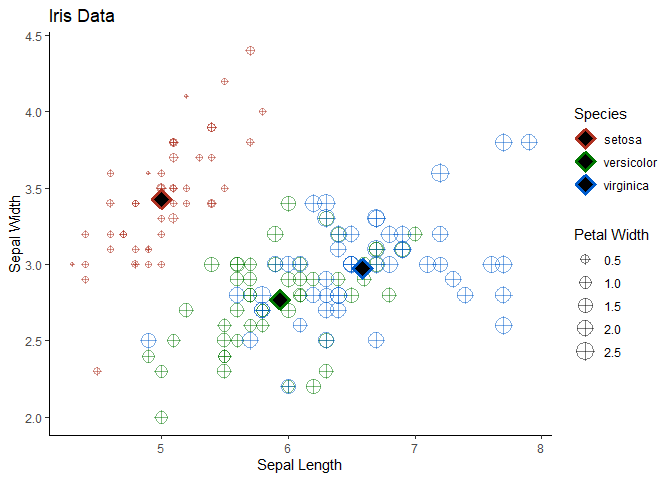
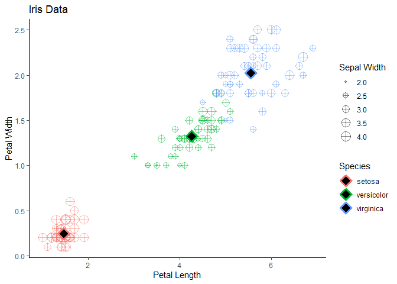

Programación-R-Santander-2022
================
Equipo 19,
Dec 09, 2022

# Manipulación y visualización de datos en R

## Postwork de la Sesión 2

``` r
library(dplyr)
```

    ## 
    ## Attaching package: 'dplyr'

    ## The following objects are masked from 'package:stats':
    ## 
    ##     filter, lag

    ## The following objects are masked from 'package:base':
    ## 
    ##     intersect, setdiff, setequal, union

``` r
library(ggplot2)
```

**1. Inspecciona el DataSet iris_meaniris disponible directamente en R.
Identifica las variables que contiene y su tipo, asegúrate de que no
hayan datos faltantes y que los datos se encuentren listos para
usarse.**  
R: En estadística se pueden clasificar los tipos de datos como
**Cuantitativos** y **Cualitativos**. Los datos Cuantitativos siempre
son numéricos y representan algún tipo de medida.Por otra parte los
datos Cualitativos representan características y pueden ser a su vez
divididos en **Ordinales** (su valores tienen precedencia) y
**Nominales** (sus valores no indican precedencia). En R, la función
*str* muestra el tipo de dato de una variable, en un dataset se obtendrá
el tipo de cada variable:

``` r
# Identificación de los tipos de datos de las variables
str(iris)
```

    ## 'data.frame':    150 obs. of  5 variables:
    ##  $ Sepal.Length: num  5.1 4.9 4.7 4.6 5 5.4 4.6 5 4.4 4.9 ...
    ##  $ Sepal.Width : num  3.5 3 3.2 3.1 3.6 3.9 3.4 3.4 2.9 3.1 ...
    ##  $ Petal.Length: num  1.4 1.4 1.3 1.5 1.4 1.7 1.4 1.5 1.4 1.5 ...
    ##  $ Petal.Width : num  0.2 0.2 0.2 0.2 0.2 0.4 0.3 0.2 0.2 0.1 ...
    ##  $ Species     : Factor w/ 3 levels "setosa","versicolor",..: 1 1 1 1 1 1 1 1 1 1 ...

Para verificar que no haya daltos faltantes primero haremos una función
que cuenta el número de “na” en un vector:

``` r
cna <- function(x){ return(length(x[is.na(x)]))}
```

Posteriormente aplicamos la función a todas las variables del dataframe
*iris* :

``` r
lapply(iris,cna)
```

    ## $Sepal.Length
    ## [1] 0
    ## 
    ## $Sepal.Width
    ## [1] 0
    ## 
    ## $Petal.Length
    ## [1] 0
    ## 
    ## $Petal.Width
    ## [1] 0
    ## 
    ## $Species
    ## [1] 0

Podemos comprobar que no hay datos faltantes

**2. Crea una gráfica de puntos que contenga *Sepal.Lenght* en el eje
horizontal, *Sepal.Width* en el eje vertical, que identifique *Species*
por color y que el tamaño de la figura está representado por
*Petal.Width*. Asegúrate de que la geometría contenga *shape* = 10 y
*alpha* = 0.5**.  
R: R nativo permite la graficación de puntos de dispersión mediante la
función *plot*. Sin embargo, el paquete *ggplot* tiene funciones que
producen los mismos tipos de gráficos que R nativo, pero con mejor
estética y opciones de despliegue.

``` r
# Carga de la librería ggplot2
library(ggplot2) 
# iris es el dataset
# En la parte de los aesthetic están los ejes,
# la asignación de colores por grupo,
# el tamaño de los puntos de acuerdo al valor de Petal.Width
# La geometría del punto define forma e intensidad  
gp <-ggplot(iris, aes(x = Sepal.Length, y = Sepal.Width, color = Species, size = Petal.Width)) + 
  geom_point(shape = 10, alpha = 0.5)
# Modificación de colores
gp <- gp + scale_color_hue(l=40, c=100)
```

**3. Crea una tabla llamada *iris_mean* que contenga el promedio de
todas las variables agrupadas por *Species*.**  
R: Para responder este ejercicio se usa el operador pipeline de
funciones *deployr*. La secuencia del pipeline inicia con el dataframe
iris que es la entrada al proceso de agrupamiento (*group_by*), una vez
clasificadas las entradas por *Species* serán la entrada a la función de
resumen de medias. El uso de pipelines tiene como objetivo encadenar
procesos donde la salida de los datos de uno son la entrada del
siguiente, de la misma forma que se hace en los shells de algunos
sistemas operativos.

``` r
iris_mean <- iris %>% group_by(Species) %>% summarise_all(mean)
iris_mean
```

    ## # A tibble: 3 × 5
    ##   Species    Sepal.Length Sepal.Width Petal.Length Petal.Width
    ##   <fct>             <dbl>       <dbl>        <dbl>       <dbl>
    ## 1 setosa             5.01        3.43         1.46       0.246
    ## 2 versicolor         5.94        2.77         4.26       1.33 
    ## 3 virginica          6.59        2.97         5.55       2.03

**4. Con esta tabla, agrega a tu gráfica anterior otra geometría de
puntos para agregar los promedios en la visualización. Asegúrate que el
primer argumento de la geometría sea el nombre de tu tabla y que los
parámetros sean *shape* = 23, *size* = 4, *fill* = “black” y *stroke* =
2. También agrega etiquetas, temas y los cambios necesarios para mejorar
tu visualización.**  
R: Al gráfico anterior se le sobrepone los puntos correspondientes a las
medias de las variables *sepal.length* y *sepal.width* para cada una de
las *Species*

``` r
gp <- gp + geom_point(data = iris_mean, shape = 23, size = 4, fill = "black", stroke = 2) +
         labs(title = "Iris Data",
              x = "Sepal Length",
              y = "Sepal Width") +
         scale_size("Petal Width") +
         theme_classic()
gp
```

<!-- --> Se puede
observar la relación evidente de que las medias de cada clase son sus
centros de masa. De forma complementaria se grafica la relación entre
los pétalos y como dimensión de tamaño el ancho del sépalo.

``` r
gp2 <-ggplot(iris, aes(x = Petal.Length, y = Petal.Width, color = Species, size = Sepal.Width)) + 
  geom_point(shape = 10, alpha = 0.5)
gp2 <- gp2 + geom_point(data = iris_mean, shape = 23, size = 4, fill = "black", stroke = 2) +
  labs(title = "Iris Data",
       x = "Petal Length",
       y = "Petal Width") +
  scale_size("Sepal Width") +
  theme_classic()
gp2
```

<!-- -->
