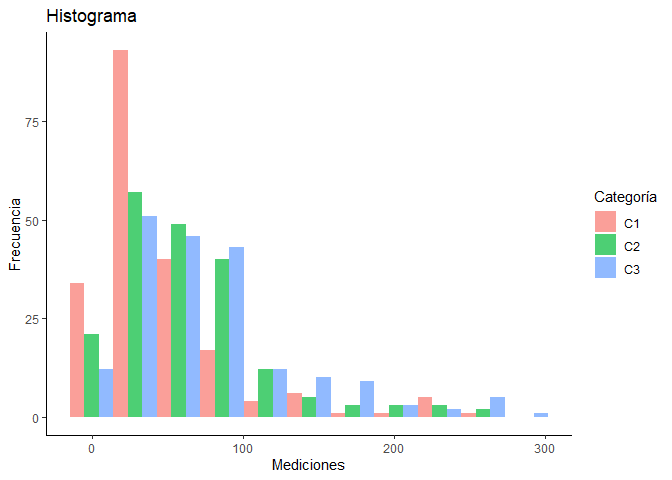
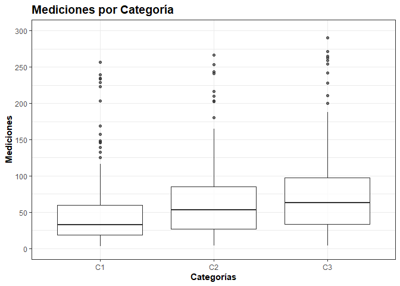

ANÁLISIS EXPLORATORIO DE DATOS <br> Postwork Sesión 3
================
Equipo 19
Diciembre 09, 2022

**Objetivo**

Realizar un análisis descriptivo de las variables de un dataframe.

**Desarrollo**

Utilizando el dataframe `boxp.csv` realiza el siguiente análisis
descriptivo. No olvides excluir los missing values y transformar las
variables a su tipo y escala correspondiente.

Primero, se establece el directorio de trabajo:

``` r
#setwd("directorio")
```

Se carga la base de datos del archivo `boxp.csv` en la variable `df`
como un `data.frame` y se inspecciona:

``` r
df <- read.csv("https://raw.githubusercontent.com/beduExpert/Programacion-R-Santander-2022/main/Sesion-03/Data/boxp.csv")

str(df)
```

    ## 'data.frame':    615 obs. of  3 variables:
    ##  $ Categoria : chr  "C1" "C1" "C1" "C1" ...
    ##  $ Grupo     : int  0 1 0 0 0 0 0 0 1 1 ...
    ##  $ Mediciones: num  82.6 112.6 42.8 44.6 21.6 ...

La estadística descriptiva del dataframe es:

``` r
summary(df)
```

    ##   Categoria             Grupo          Mediciones    
    ##  Length:615         Min.   :0.0000   Min.   :  2.80  
    ##  Class :character   1st Qu.:0.0000   1st Qu.: 23.45  
    ##  Mode  :character   Median :0.0000   Median : 49.30  
    ##                     Mean   :0.2439   Mean   : 62.88  
    ##                     3rd Qu.:0.0000   3rd Qu.: 82.85  
    ##                     Max.   :1.0000   Max.   :290.60  
    ##                                      NA's   :24

Se observa que las estadísticas de las variables `Categoría` y `Grupo`
no tienen mucho sentido. Enseguida se transforman estas variables a su
tipo y escala correspondiente.

``` r
df$Categoria<-factor(df$Categoria,labels =c("C1","C2","C3"))
df$Grupo<-factor(df$Grupo,labels=c("A","B"))
```

Revisamos nuevamente la estadística descriptiva del dataframe:

``` r
summary(df)
```

    ##  Categoria Grupo     Mediciones    
    ##  C1:205    A:465   Min.   :  2.80  
    ##  C2:205    B:150   1st Qu.: 23.45  
    ##  C3:205            Median : 49.30  
    ##                    Mean   : 62.88  
    ##                    3rd Qu.: 82.85  
    ##                    Max.   :290.60  
    ##                    NA's   :24

En la tabla se observa una descripción precisa del dataframe, debido a
que las variables se transfomaron a su tipo y escala correspondiente.

**1) Calcula e interpreta las medidas de tendencia central de la
variable `Mediciones`.**

LLamamos a la libreria `DescTools` para tener todas las funciones
estadísticas:

``` r
library(DescTools)
```

Ahora, se calcula las medidas de tendencia central usando las funciones
`mean`, `median` y `Mode`.

**Media**

``` r
mean(df$Mediciones)
```

    ## [1] NA

La instrucción devuelve un resultado erróneo, ésto se debe a que existen
valores faltantes para algunos registros de la variable mediciones (ver
la estadística descriptiva anterior). No obstante, el argumento
(**na.rm**) de las funciones como `mean` sirve para eliminar los valores
faltantes antes del computo.

Volvamos a aplicar la función `mean` con argumento `na.rm=TRUE`:

``` r
mean(df$Mediciones,na.rm = TRUE)
```

    ## [1] 62.88494

Como puedo observarse, el cómputo se hizó correctamente.

*Interpretación:* El valor promedio de valores de la variable
`mediciones` es 62.88494.

Ahora se calculan las medidas faltantes:

**Media truncada**

``` r
mean(df$Mediciones,na.rm = TRUE,trim=0.25)
```

    ## [1] 50.05556

*Interpretación:* El valor promedio sin el 25% de los valores extremos
de la variable `mediciones` es 50.05556.

**Mediana**

``` r
median(df$Mediciones,na.rm = TRUE)
```

    ## [1] 49.3

*Interpretación:* 49.3 es el valor que divide en dos partes a los datos
de la variable `mediciones`.

**Moda**

``` r
Mode(df$Mediciones,na.rm=TRUE)[1]
```

    ## [1] 23.3

*Interpretación:* El valor que más se repite entre los datos de la
variable `mediciones` es 23.3.

**2) Con base en tu resultado anterior, ¿qué se puede concluir respecto
al sesgo de `Mediciones`?**

R: Dado que moda=23.3\<mediana=49.3\<media=50.0, entonces los datos
tienen una distribución con sesgo a la derecha.

**3) Calcula e interpreta la desviación estándar y los cuartiles de la
distribución de `Mediciones`.**

**Desviación estándar**

``` r
sd(df$Mediciones,na.rm = TRUE)
```

    ## [1] 53.76972

*Interpretación:* de acuerdo con el teorema de Chebyshev, al menos el
75% de los datos caen dentro de -2,+2 desviaciones estándar a partir de
la media, es decir dentro del intervalo \[0,170.4244\], y un 89% de los
valores dentro de -3,+3, es decir dentro del intervalo \[0,224.1941\].

Enseguida se presenta el cómputo de los valores de los límites de los
intervalos. En el cálculo se presentan dos valores negativos que no se
toman en cuenta puesto que las mediciones no pueden tener valores
negativos, así que son sustituidos por el valor 0.

``` r
62.88494+2*53.76972
```

    ## [1] 170.4244

``` r
62.88494-2*53.76972
```

    ## [1] -44.6545

``` r
62.88494+3*53.76972
```

    ## [1] 224.1941

``` r
62.88494-3*53.76972
```

    ## [1] -98.42422

Para saber si la desviación estándar es alta o baja usemos el
coeficiente de variación:

``` r
sd(df$Mediciones,na.rm = TRUE)/mean(df$Mediciones,na.rm = TRUE)*100
```

    ## [1] 85.50493

El coeficiente de variación es muy alto, esto quiere decir que los datos
estan muy dispersos.

**Cuartiles**

``` r
quantile(df$Mediciones,probs=c(0.25,0.5,0.75),na.rm = TRUE )
```

    ##   25%   50%   75% 
    ## 23.45 49.30 82.85

*Interpretación:* El 25% de los datos de la variable `Mediciones` esta
por debajo de 23.45, el 50% es menor o igual que 49.30 y el 75% de los
valores esta por debajo de 82.85.

**4) Con ggplot, realiza un histograma separando la distribución de
`Mediciones` por `Categoria`. ¿Consideras que sólo una categoría está
generando el sesgo?**

R:

Comencemos por eliminar los datos faltantes para realizar los cálculos
correctamente. Para esto vamos a usar la función `drop_na` de la
librería `tidyr` para eliminar los datos faltantes con respecto a la
variable `Mediciones`.

``` r
library(tidyr)
df1<-drop_na(df,Mediciones)
dl<-df1$Mediciones
length(dl)
```

    ## [1] 591

Se eliminaron 24 registros los cuales corresponden a los datos
faltantes. Ahora vamos a calcular el número de clases y el ancho de la
clase.

``` r
k = ceiling(1 + 3.3*log10(length(dl)))# Número de clases
k
```

    ## [1] 11

``` r
ac = (max(dl)-min(dl))/k # Ancho de la clase
ac
```

    ## [1] 26.16364

Enseguida creamos una secuencia que vaya del valor mínimo al máximo con
el ancho de clase.

``` r
bins <-seq(min(dl),max(dl), by=ac)
bins
```

    ##  [1]   2.80000  28.96364  55.12727  81.29091 107.45455 133.61818 159.78182
    ##  [8] 185.94545 212.10909 238.27273 264.43636 290.60000

A continuación se genera el histograma separando con respecto a la
variable `Categoria`

``` r
library(ggplot2)
histograma<-ggplot(df1, aes(x=Mediciones,fill=Categoria)) +
  geom_histogram(bins = 11,alpha=0.7,position="dodge") + 
  labs(title = "Histograma", 
       x = "Mediciones",
       y = "Frecuencia", fill="Categoría")+
  theme_classic()

histograma
```

<!-- -->

**¿Consideras que sólo una categoría está generando el sesgo?**

R: No, ya que, conforme al histograma, todas las variables se inclinan
hacia un lado, lo que ocasiona el sesgo.

**5 Con ggplot, realiza un boxplot separando la distribución de
`Mediciones` por `Categoria` y por `Grupo` dentro de cada categoría.**

``` r
ggplot(df1,aes(x =Categoria, y = Mediciones)) + geom_boxplot(alpha=0.7)+scale_x_discrete(name="Categorías")+scale_y_continuous(name="Mediciones", breaks=seq(0,300,50),limits=c(0,300))+ggtitle("Mediciones por Categoría")+theme_bw()+theme(plot.title=element_text(size=14,face="bold"),axis.title=element_text(face="bold"))+scale_fill_brewer(palette="Accent")
```

<!-- -->

``` r
library(RColorBrewer)
ggplot(df1,aes(x =Categoria, y = Mediciones,fill=Grupo)) + geom_boxplot(alpha=0.7)+scale_x_discrete(name="Categorías")+scale_y_continuous(name="Mediciones", breaks=seq(0,300,50),limits=c(0,300))+ggtitle("Mediciones por Categoría y Grupo")+theme_bw()+theme(plot.title=element_text(size=14,face="bold"),axis.title=element_text(face="bold"))+scale_fill_brewer(palette="Accent")+labs(fill="Grupo")
```

<!-- -->

**¿Consideras que hay diferencias entre categorías?**

R: La dispersión de categorías C2 y C3 son bastante similares, ambas
presentan más dispersión que la categoría C1. Sin embargo, por la forma
de las cajas todas muestran un sesgo positivo.

**¿Los grupos al interior de cada categoría podrían estar generando el
sesgo?**

R: En el grupo A existen más datos atípicos y sus medianas incrementan
con respecto a la categoría. No obstante, tanto las cajas del grupo A
como las del B presentan un sesgo positivo, lo que provoca el sesgo de
la distribución.
