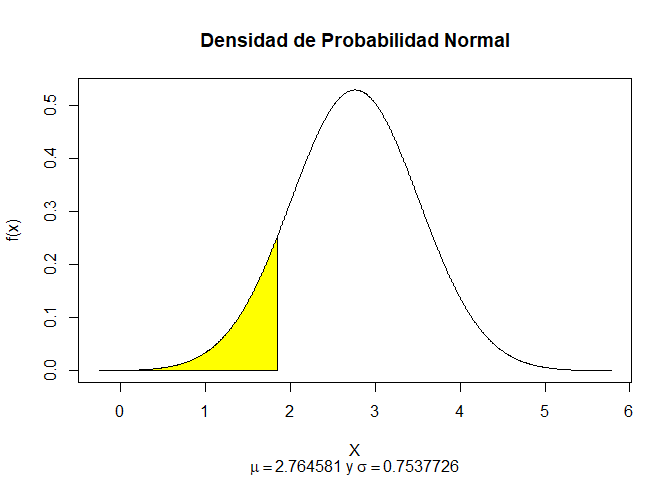

PROBABILIDAD Y FUNCIONES DE DISTRIBUCIÓN <br> Llamadas internacionales
<br> Postwork Sesión 4
================
Equipo 19,
Diciembre 09, 2022

**Objetivo**

Realizar un análisis probabilístico del total de cargos internacionales
de una compañía de telecomunicaciones.

**Desarrollo**

Utilizando la variable `total_intl_charge` de la base de datos
`telecom_service.csv` de la sesión 3, realiza un análisis
probabilístico. Para ello, debes determinar la función de distribución
de probabilidad que más se acerque el comportamiento de los datos.

*Hint:* Puedes apoyarte de medidas descriptivas o técnicas de
visualización.

- Determinar la función de distribución de los datos.

Primero, se establece el directorio de trabajo:

``` r
#setwd("directorio")
```

Cargamos la base de datos del archivo `telecom_service.csv` en la
variable `df` como un `data.frame`:

``` r
df <- read.csv("https://raw.githubusercontent.com/beduExpert/Programacion-R-Santander-2022/main/Sesion-03/Data/telecom_service.csv")
```

*Hint:* Puedes apoyarte de medidas descriptivas o técnicas de
visualización.

Los histogramas nos ayudan a conocer la distribución de la variable, la
cual junto con su forma, nos ayuda a entender el comportamiento de los
datos. Veamos el histograma de la variable `total_intl_charge`.

``` r
k = ceiling(1 + 3.3*log10(length(df$total_intl_charge)))# Número de clases
k
```

    ## [1] 13

``` r
ac = (max(df$total_intl_charge)-min(df$total_intl_charge))/k # Ancho de la clase
ac
```

    ## [1] 0.4153846

Enseguida creamos una secuencia que vaya del valor mínimo al máximo con
el ancho de clase y hacemos cortes con las clases correspondientes:

``` r
bins <-seq(min(df$total_intl_charge),max(df$total_intl_charge), by=ac)
bins
```

    ##  [1] 0.0000000 0.4153846 0.8307692 1.2461538 1.6615385 2.0769231 2.4923077
    ##  [8] 2.9076923 3.3230769 3.7384615 4.1538462 4.5692308 4.9846154 5.4000000

``` r
clases <-cut(df$total_intl_charge,breaks=bins,include.lowest = TRUE,diag.lab=8)
```

Ahora generamos el histograma:

``` r
library(ggplot2)
ggplot(df, aes(total_intl_charge)) +
  geom_histogram(bins = 13,alpha=0.7,position="dodge") + 
  labs( x = "total_intl_charge", y = "Frecuencia")+ggtitle("Distribución de la variable total_intl_charge") +
  theme(plot.title = element_text(hjust = 0.5))+theme_classic()
```

<!-- -->
Revisemos las estadísticas:

``` r
summary(df$total_intl_charge)
```

    ##    Min. 1st Qu.  Median    Mean 3rd Qu.    Max. 
    ##   0.000   2.300   2.780   2.765   3.270   5.400

``` r
library(DescTools)
Mode(df$total_intl_charge)
```

    ## [1] 2.7
    ## attr(,"freq")
    ## [1] 62

Observe que la media, la moda y la mediana son aproximadamente iguales y
la distribución tiene forma de campana. Ademas, la media y la desviación
estándar son:

``` r
mean=mean(df$total_intl_charge)
sd=sd(df$total_intl_charge)
mean
```

    ## [1] 2.764581

``` r
sd
```

    ## [1] 0.7537726

**Modelo:** Se supone que la variable `total_intl_charge` tiene una
función de distribución normal con media $\mu=2.764581$ y desviación
estándar $\sigma=0.7537726$.

- Una vez que hayas seleccionado el modelo, realiza lo siguiente:

**1) Grafica la distribución teórica de la variable aleatoria
`total_intl_charge`.**

``` r
{curve(dnorm(x, mean = 2.764581, sd =0.7537726 ), from = 0, to = 5.6, 
        col='blue', main = "distribución teórica de la variable total_intl_charge",
        ylab = "f(x)", xlab = "x")}
```

<!-- -->

**2) ¿Cuál es la probabilidad de que el total de cargos internacionales
sea menor a 1.85 usd?**

``` r
pnorm(q=1.85,mean=mean,sd=sd)
```

    ## [1] 0.1125002

``` r
x <- seq(-4, 4, 0.01)*sd + mean
y <- dnorm(x, mean = mean, sd = sd) 
plot(x, y, type = "l", xlab = "X", ylab = "f(x)",
     main = "Densidad de Probabilidad Normal", 
     sub = expression(paste(mu ==2.764581, " y ", sigma == 0.7537726)))
polygon(c(min(x), x[x<=1.85], 1.85), c(0, y[x<=1.85], 0), col="yellow")
```

<!-- --> R:
La probabilidad de que el total de cargos internacionales sea menor a
1.85 usd es $P(x<=1.85)=0.1125002$

**3) ¿Cuál es la probabilidad de que el total de cargos internacionales
sea mayor a 3 usd?**

``` r
pnorm(3, mean, sd, lower.tail = FALSE)
```

    ## [1] 0.3773985

``` r
x <- seq(-4, 4, 0.01)*sd + mean
y <- dnorm(x, mean = mean, sd = sd) 
plot(x, y, type = "l", xlab = "X", ylab = "f(x)",
     main = "Densidad de Probabilidad Normal", 
     sub = expression(paste(mu ==2.764581, " y ", sigma == 0.7537726)))
polygon(c(3, x[x>=3], max(x)), c(0, y[x>=3], 0), col="blue")
```

<!-- --> R:
La probabilidad de que el total de cargos internacionales sea mayor a 3
usd es $P(x\geq 3)=0.3773985$

**4) ¿Cuál es la probabilidad de que el total de cargos internacionales
esté entre 2.35 usd y 4.85 usd?**

``` r
pnorm(4.85, mean, sd)-pnorm(2.35, mean, sd)
```

    ## [1] 0.7060114

``` r
x <- seq(-4, 4, 0.01)*sd + mean
y <- dnorm(x, mean = mean, sd = sd) 
plot(x, y, type = "l", xlab = "X", ylab = "f(x)",
     main = "Densidad de Probabilidad Normal", 
     sub = expression(paste(mu ==2.764581, " y ", sigma == 0.7537726)))
polygon(c(2.3, x[x>=2.3 & x<=4.85], 4.85), c(0, y[x>= 2.3 & x<=4.85], 0), col="green")
```

<!-- --> R:
La probabilidad de que el total de cargos internacionales esté entre
2.35usd y 4.85 usd es $P(2.35\leq x\leq 4.85)=0.7060114$.

**5) Con una probabilidad de 0.48, ¿cuál es el total de cargos
internacionales más alto que podría esperar? $P(X<=x)=0.48$.**

``` r
qnorm(p=0.48,mean,sd)
```

    ## [1] 2.726777

``` r
x <- seq(-4, 4, 0.01)*sd + mean
y <- dnorm(x, mean = mean, sd = sd) 
plot(x, y, type = "l", xlab = "X", ylab = "f(x)",
     main = "Densidad de Probabilidad Normal", 
     sub = expression(paste(mu ==2.764581, " y ", sigma == 0.7537726)))
polygon(c(min(x), x[x<=2.726777], 2.726777), c(0, y[x<=2.726777], 0), col="red")
```

<!-- -->

R: El total de cargos internacionales más alto que podría esperar es
$2.726777$.

*Comprobación:*

``` r
pnorm(2.726777, mean, sd)
```

    ## [1] 0.48

**6) ¿Cuáles son los valores del total de cargos internacionales que
dejan exactamente al centro el 80% de probabilidad?**

``` r
qnorm(0.9, mean, sd)
```

    ## [1] 3.73058

``` r
qnorm(0.1, mean, sd)
```

    ## [1] 1.798583

``` r
x <- seq(-4, 4, 0.01)*sd + mean
y <- dnorm(x, mean = mean, sd = sd) 
plot(x, y, type = "l", xlab = "X", ylab = "f(x)",
     main = "Densidad de Probabilidad Normal", 
     sub = expression(paste(mu ==2.764581, " y ", sigma == 0.7537726)))
polygon(c(1.798583, x[x>=1.798583 & x<=3.73058], 3.73058), c(0, y[x>= 1.798583 & x<=3.73058], 0), col="green")
```

<!-- --> R:
El intervalo es $[1.798583,3.73058]$

*Comprobación:*

``` r
pnorm(3.73058, mean, sd)-pnorm(1.798583, mean, sd)
```

    ## [1] 0.8
