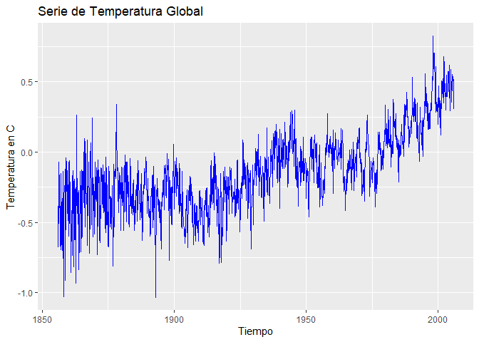
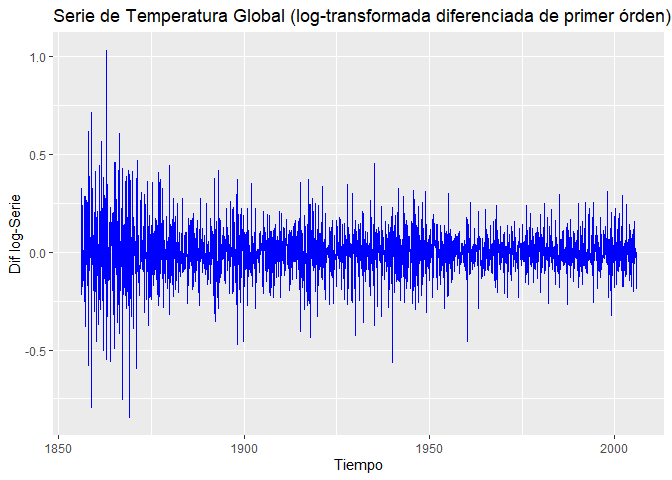
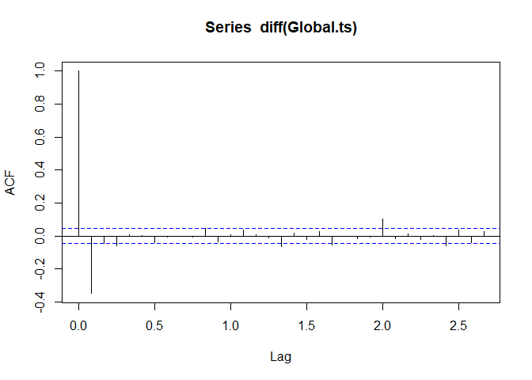
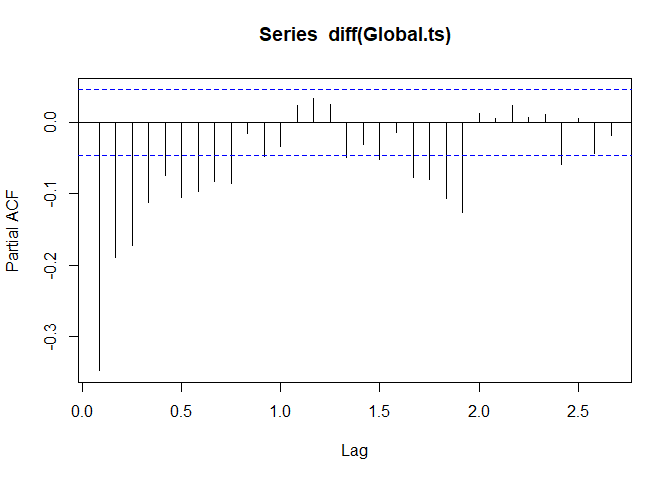

Postwork7
================
Equipo19

# Series de Tiempo

### Postwork de la Sesion 7

Objetivo

- Estimar modelos ARIMA y realizar predicciones

Utilizando el siguiente vector numérico presentado debajo, realiza lo
que se indica

``` r
#Se convocan las librerias a usar
library(ggplot2)
library(ggfortify)
```

Se llama al archivo que contiene los datos y se transforma a un vector

``` r
url = "https://raw.githubusercontent.com/beduExpert/Programacion-R-Santander-2022/main/Sesion-07/Data/global.txt"
Global <- scan(url, sep="")
```

Se checa que la variable `Global` haya guardado de manera correcta los
valores

``` r
str(Global)
```

    ##  num [1:1800] -0.384 -0.457 -0.673 -0.344 -0.311 -0.071 -0.246 -0.235 -0.38 -0.418 ...

**1. Crea un objeto de serie de tiempo con los datos de Global. La serie
debe ser mensual comenzando en Enero de**

Se usa la función *ts* para convertir el vector `Global` a un objeto de
la clase *ts*. Ya que es necesario que la información sea mensual, se
usa el parámero *fr* (frecuencia) para definirlo mensual (12)

``` r
Global.ts <- ts(Global, st = c(1856, 1), fr = 12)
#Se comprueba el contenido de Global.ts y su clase
str(Global.ts)
```

    ##  Time-Series [1:1800] from 1856 to 2006: -0.384 -0.457 -0.673 -0.344 -0.311 -0.071 -0.246 -0.235 -0.38 -0.418 ...

``` r
class(Global.ts)
```

    ## [1] "ts"

**2. Realiza una gráfica de la serie de tiempo anterior de 2006**

Se procede a usar *autoplot* para graficar.

``` r
autoplot(Global.ts, ts.colour = "blue", xlab = "Tiempo", ylab = "Temperatura en C")+ ggtitle("Serie de Temperatura Global")
```

<!-- -->

Después de graficar, se observa como la varianza no es estable y que
tiende a crecer para no regresar a su media, lo que sugiere un ts no
estacionario.

**3. Ahora realiza una gráfica de la serie de tiempo anterior,
transformando a la primera diferencia**

Al requerirse transformar la ts a la primer diferencia, es necesario el
uso de la función *diff* y el resto de los argumentos quedan muy
parecidos al anterior *autoplot*.

``` r
autoplot(diff(Global.ts), ts.colour = "blue", xlab = "Tiempo", ylab = 
           "Dif log-Serie") + ggtitle("Serie de Temperatura Global (log-transformada diferenciada de primer órden)")
```

<!-- -->

Al aplicarse la primera diferencia, se puede observar ya un ts
estacionario.

**4. ¿Consideras que la serie es estacionaria en niveles o en primera
diferencia?**

Debido que en primera diferencia se logra obtener un compartamiento que
asemeja un ts estacionario se concluye que la serie es estacionaria en
primera diferencia.

**5. Con base en tu respuesta anterior, obtén las funciones de
autocorrelación y autocorrelación parcial?**

Se utiliza la funcion *acf* para producir la funcion de autocorrelación
donde se puede observar como en pocos rezagos, la autocorrelación toca o
pasa varias veces el límite crítico por lo que se concluye que hay
cierto nivel dependencia rechazando la hipotesis nula.

``` r
acf(diff(Global.ts))
```

<!-- -->

A continuación se usa la función *pacf* para calcular la autocorrelación
parcial. Al igual que le correlación total, en la gráfica se puede
observar como, en pocos períodos de rezago, se excede el valor crítico
debido al ruido del termino aleatorio.

``` r
pacf(diff(Global.ts))
```

<!-- -->

**6. De acuerdo con lo observado en las gráficas anteriores, se sugiere
un modelo ARIMA con AR(1), I(1) y MA desde 1 a 4 rezagos Estima los
diferentes modelos ARIMA propuestos:**

Para poder modelar arima se usa la función con el mismo nombre `arima`:

``` r
arima(Global.ts, order = c(1, 1, 1))
```

    ## 
    ## Call:
    ## arima(x = Global.ts, order = c(1, 1, 1))
    ## 
    ## Coefficients:
    ##          ar1      ma1
    ##       0.3797  -0.8700
    ## s.e.  0.0433   0.0293
    ## 
    ## sigma^2 estimated as 0.01644:  log likelihood = 1142.13,  aic = -2278.26

Se pueden observar los coeficientes ar1 y ma1 pero realmente el que
definirá el modelo a elegir es el coeficiente aic. Para este modelo es
de -2278.26, se correrán los otros 3 con el fin de encontrar el aic de
menor valor.

``` r
arima(Global.ts, order = c(1, 1, 2))
```

    ## 
    ## Call:
    ## arima(x = Global.ts, order = c(1, 1, 2))
    ## 
    ## Coefficients:
    ##          ar1      ma1     ma2
    ##       0.7593  -1.2992  0.3190
    ## s.e.  0.0354   0.0487  0.0452
    ## 
    ## sigma^2 estimated as 0.01616:  log likelihood = 1157.48,  aic = -2306.96

``` r
arima(Global.ts, order = c(1, 1, 3))
```

    ## 
    ## Call:
    ## arima(x = Global.ts, order = c(1, 1, 3))
    ## 
    ## Coefficients:
    ##          ar1      ma1     ma2     ma3
    ##       0.8171  -1.3518  0.3087  0.0575
    ## s.e.  0.0406   0.0490  0.0407  0.0326
    ## 
    ## sigma^2 estimated as 0.01613:  log likelihood = 1158.94,  aic = -2307.88

``` r
arima(Global.ts, order = c(1, 1, 4))
```

    ## 
    ## Call:
    ## arima(x = Global.ts, order = c(1, 1, 4))
    ## 
    ## Coefficients:
    ##          ar1      ma1     ma2     ma3     ma4
    ##       0.8704  -1.4030  0.3478  0.0053  0.0600
    ## s.e.  0.0335   0.0411  0.0438  0.0401  0.0273
    ## 
    ## sigma^2 estimated as 0.01609:  log likelihood = 1161.2,  aic = -2310.39

Despues de observar los 4 modelos, se concluye que el arima(1,1,4) es el
mejor debido a su aic es el menor de los 4 modelos propuestos.

Se puede decir el comportamiento es el siguiente:

`x[t]=0.8704x[t-1]-1.403w[t-1]+0.3478w[t-2]+0.0053w[t-3]+0.06w[t-4]+w[t]`

**7. Con base en el criterio de Akaike, estima el mejor modelo ARIMA y
realiza una predicción de 12 periodos (meses)**

Como se menciona en la respuesta anterios, el mejor modelo ARIMA es el
(1,1,4). Se guarda este modelo en la variable `fit`.

``` r
fit <- arima(Global.ts, order = c(1, 1, 4))
```

Para realizar una predicción, se usa la función *predict* y debido a que
es para un período de 12 meses, se agrega el 12 en el segundo parámetro.

``` r
(pr <- predict(fit, 12)$pred)
```

    ##            Jan       Feb       Mar       Apr       May       Jun       Jul
    ## 2006 0.3944191 0.4109006 0.4241679 0.4249647 0.4256583 0.4262620 0.4267875
    ##            Aug       Sep       Oct       Nov       Dec
    ## 2006 0.4272449 0.4276430 0.4279895 0.4282911 0.4285537

La función *predict* regresa un vector con la predicción de los
siguientes 12 meses que sería de Enero de 2006 a Diciembre de 2006.
