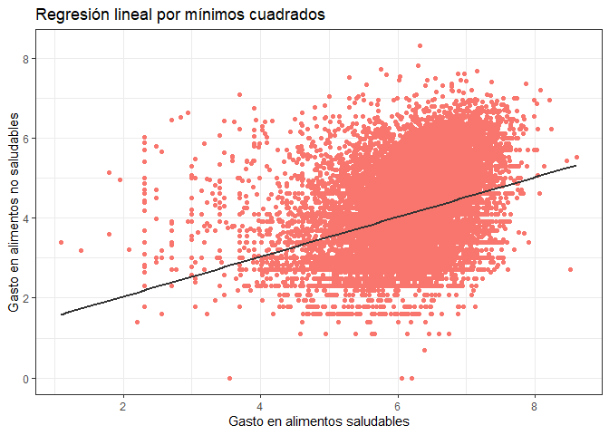

Postwork8
================
Equipo19
2022-12-16

Si consideramos que las librerias ya se encuentran instaladas, solo las
cargamos de la siguiente manera

------------------------------------------------------------------------

# Postwork 8

## Objetivo

-   Realizar un análisis estadístico completo de un caso.
-   Publicar en un repositorio de Github el análisis y el código
    empleado.

## **Requisitos**

-   Haber realizado los works y postworks previos.
-   Tener una cuenta en Github o en RStudioCloud.

## **Desarrollo**

Un centro de salud nutricional está interesado en analizar
estadísticamente y probabilísticamente los patrones de gasto en
alimentos saludables y no saludables en los hogares mexicanos con base
en su nivel socioeconómico, en si el hogar tiene recursos financieros
extras al ingreso y en si presenta o no inseguridad alimentaria. Además,
está interesado en un modelo que le permita identificar los
determinantes socioeconómicos de la inseguridad alimentaria.

La base de datos es un extracto de la Encuesta Nacional de Salud y
Nutrición (2012) levantada por el Instituto Nacional de Salud Pública en
México. La mayoría de las personas afirman que los hogares con menor
nivel socioeconómico tienden a gastar más en productos no saludables que
las personas con mayores niveles socioeconómicos y que esto, entre otros
determinantes, lleva a que un hogar presente cierta inseguridad
alimentaria.

La base de datos contiene las siguientes variables:

-   nse5f (Nivel socioeconómico del hogar):

    -   1 “Bajo”
    -   2 “Medio bajo”
    -   3 “Medio”
    -   4 “Medio alto”
    -   5 “Alto”

-   area (Zona geográfica):

    -   0 “Zona urbana”
    -   1 “Zona rural”

-   numpeho (Número de persona en el hogar)

-   refin (Recursos financieros distintos al ingreso laboral):

    -   0 “no”
    -   1 “sí”

-   edadjef (Edad del jefe/a de familia)

-   sexoje (Sexo del jefe/a de familia):

    -   0 “Hombre”
    -   1 “Mujer”

-   añosedu (Años de educación del jefe de familia)

-   ln_als (Logaritmo natural del gasto en alimentos saludables)

-   ln_alns (Logaritmo natural del gasto en alimentos no saludables)

-   IA (Inseguridad alimentaria en el hogar):

    -   0 “No presenta IA”
    -   1 “Presenta IA”

Después de conocer los datos, se procede a cargar y preparar los datos.

### Carga de datos

Se carga la base de datos del archivo `boxp.csv` en la variable `df`
como un `data.frame` y se inspecciona su estructura:

``` r
df<-read.csv("https://raw.githubusercontent.com/beduExpert/Programacion-R-Santander-2022/main/Sesion-08/Postwork/inseguridad_alimentaria_bedu.csv") # 
str(df)#inspección del dataframe
```

    ## 'data.frame':    40809 obs. of  10 variables:
    ##  $ nse5f  : int  5 5 5 5 5 5 5 5 5 5 ...
    ##  $ area   : int  0 0 0 1 0 0 0 1 0 0 ...
    ##  $ numpeho: int  4 5 4 1 2 5 9 4 4 5 ...
    ##  $ refin  : int  0 1 0 0 1 1 0 0 0 0 ...
    ##  $ edadjef: int  43 NA 46 54 39 NA NA 48 54 41 ...
    ##  $ sexojef: int  0 NA 0 0 0 NA NA 0 0 0 ...
    ##  $ añosedu: int  24 24 24 24 24 24 24 24 24 24 ...
    ##  $ IA     : int  0 0 0 0 0 0 1 0 0 0 ...
    ##  $ ln_als : num  5.39 7.02 6.77 3.4 6.12 ...
    ##  $ ln_alns: num  NA NA 4.61 4.09 5.48 ...

### Limpieza de datos

Se observan datos faltantes en el dataframe cargado, para omitirlos se
usa la siguiente instrucción:

``` r
dfclean <- na.omit(df)
dfclean2 <- na.omit(df)
dim(dfclean)[1] #Revisando la nueva dimensión
```

    ## [1] 20280

Se han eliminado 20529 datos.

### Transformación de las variables a su tipo y escala correspondiente

Enseguida se presenta la estadística descriptiva del dataframe:

``` r
summary(dfclean)
```

    ##      nse5f            area           numpeho           refin       
    ##  Min.   :1.000   Min.   :0.0000   Min.   : 1.000   Min.   :0.0000  
    ##  1st Qu.:2.000   1st Qu.:0.0000   1st Qu.: 3.000   1st Qu.:0.0000  
    ##  Median :3.000   Median :0.0000   Median : 4.000   Median :0.0000  
    ##  Mean   :3.097   Mean   :0.3117   Mean   : 3.991   Mean   :0.1903  
    ##  3rd Qu.:4.000   3rd Qu.:1.0000   3rd Qu.: 5.000   3rd Qu.:0.0000  
    ##  Max.   :5.000   Max.   :1.0000   Max.   :19.000   Max.   :1.0000  
    ##     edadjef          sexojef          añosedu           IA        
    ##  Min.   : 18.00   Min.   :0.0000   Min.   : 0.0   Min.   :0.0000  
    ##  1st Qu.: 36.00   1st Qu.:0.0000   1st Qu.: 9.0   1st Qu.:0.0000  
    ##  Median : 46.00   Median :0.0000   Median :12.0   Median :1.0000  
    ##  Mean   : 47.32   Mean   :0.2166   Mean   :10.9   Mean   :0.7114  
    ##  3rd Qu.: 57.00   3rd Qu.:0.0000   3rd Qu.:12.0   3rd Qu.:1.0000  
    ##  Max.   :101.00   Max.   :1.0000   Max.   :24.0   Max.   :1.0000  
    ##      ln_als         ln_alns     
    ##  Min.   :1.099   Min.   :0.000  
    ##  1st Qu.:5.844   1st Qu.:3.401  
    ##  Median :6.274   Median :4.007  
    ##  Mean   :6.192   Mean   :4.119  
    ##  3rd Qu.:6.633   3rd Qu.:4.868  
    ##  Max.   :8.605   Max.   :8.298

Se observa que las estadísticas de las variables como nivel
socieconómico, área y recursos financieros no tienen mucho sentido. Así
pues, es importante definirlas correctamente. Para realizar esto último
es importante clasificarlas.

#### Clasificación de las variables

Las *Variables cualitativas nominales* son aquéllas variables
cualitativas que no admiten un criterio de orden. Dentro de este grupo,
se tienen a las siguientes variables: zona geográfica (área), recursos
financieros distintos al ingreso laboral (refin), sexo del jefe/a de
familia (sexoje) e inseguridad alimentaria en el hogar (IA).

``` r
dfclean$area <- factor(dfclean$area,labels=c("Zona urbana","Zona rural"))
dfclean$refin <- factor(dfclean$refin,labels=c("No","Si"))
dfclean$sexojef <- factor(dfclean$sexojef,labels=c("Hombre","Mujer"))
dfclean$IA <- factor(dfclean$IA,labels=c("No presenta IA","Presenta IA"))
```

Las *variables cualitativas ordinales* son aquéllas variables
cualitativas que expresa con palabras una cualidad de naturaleza
ordenable. Dentro de este este grupo se clasifica la variable nivel
socioeconómico del hogar (nse5f).

``` r
dfclean$nse5f <- factor(dfclean$nse5f, labels=c("Bajo","Medio Bajo","Medio","Medio Alto","Alto"), ordered = TRUE)
```

Las *variables cuantitativas discretas* son aquéllas que pueden asumir
un número contable de valores. Dentro de este grupo se tiene a la
variable número de persona en el hogar (numpeho). En el caso de las
variables años de educación del jefe de familia (añosedu) y edad del
jefe/a de familia (edadjef) en años cumplidos, ambas se manejan en
valores enteros es por esto que también se clasifican dentro las
variables discretas. Las variables antes mencionadas estan definidas
como enteros, así que no es nesesario realizar su transformación.

Las *variables cuantitativas continuas* son aquéllas que puede asumir un
número infinito de valores. Dentro de este grupo tenemos dos variables:
logaritmo natural del gasto en alimentos saludables(ln_als) y logaritmo
natural del gasto en alimentos no saludables (ln_alns). Ambas estan
definidas correctamente.

Enseguida se muestra la estadística descriptiva del dataframe con las
variables ya transformadas.

``` r
summary(dfclean)
```

    ##         nse5f               area          numpeho       refin     
    ##  Bajo      :3553   Zona urbana:13959   Min.   : 1.000   No:16421  
    ##  Medio Bajo:3927   Zona rural : 6321   1st Qu.: 3.000   Si: 3859  
    ##  Medio     :4119                       Median : 4.000             
    ##  Medio Alto:4364                       Mean   : 3.991             
    ##  Alto      :4317                       3rd Qu.: 5.000             
    ##                                        Max.   :19.000             
    ##     edadjef         sexojef         añosedu                  IA       
    ##  Min.   : 18.00   Hombre:15887   Min.   : 0.0   No presenta IA: 5853  
    ##  1st Qu.: 36.00   Mujer : 4393   1st Qu.: 9.0   Presenta IA   :14427  
    ##  Median : 46.00                  Median :12.0                         
    ##  Mean   : 47.32                  Mean   :10.9                         
    ##  3rd Qu.: 57.00                  3rd Qu.:12.0                         
    ##  Max.   :101.00                  Max.   :24.0                         
    ##      ln_als         ln_alns     
    ##  Min.   :1.099   Min.   :0.000  
    ##  1st Qu.:5.844   1st Qu.:3.401  
    ##  Median :6.274   Median :4.007  
    ##  Mean   :6.192   Mean   :4.119  
    ##  3rd Qu.:6.633   3rd Qu.:4.868  
    ##  Max.   :8.605   Max.   :8.298

Se observa las estadísticas se calculan correctamente. Una vez
preparados los datos se continua con su análisis.

``` r
par(mfrow=c(3,3))

{ hist(dfclean$ln_als, main = "Gasto en alimentos saludables", xlab = "Gasto ($)")
  
  hist(dfclean$ln_alns, main = "Gasto en alimentos no saludables", xlab = " Gasto($)")
  
  hist(dfclean$numpeho, main = "Personas en el hogar", xlab = "Número de personas")
  
  barplot(100* sort(table(dfclean$nse5f)) / length(dfclean$nse5f), main = "Nivel socioeconomico", las = 3, ylab = "Porcentaje", col = "lightblue")
  
  barplot(100* sort(table(dfclean$refin), decreasing=T) / length(dfclean$refin), main = "Ingresos extra", ylab = "Porcentaje", col = "lightblue")
  
  barplot(100* sort(table(dfclean$IA), decreasing=T) / length(dfclean$IA), main = "Inseguridad alimentaria", ylab = "Porcentaje", col = "lightblue")
 
  par(mar=c(0, 0, 1.1, 0))
 # pie(table(dfclean$IA),labels <- round((100* sort(table(dfclean$IA)) / length(dfclean$IA)),1), main = "Inseguridad alimentaria")
  
  pie(table(dfclean$area),labels <- c("Urbana", "Rural"), main = "Area")
  
  pie(table(dfclean$sexoje), labels <- c("Hombre", "Mujer"), main = "Sexo")}
```

<!-- -->

------------------------------------------------------------------------

## 2. Realiza un análisis descriptivo de la información

Se obtienen las tablas de frecuencia y frecuencia relativa para las
variables: nivel socioeconomico, Ingreso extra, inseguridad alimentaria,
area, sexo, para complementar los datos obtenidos del resumen.

``` r
freq.nse <- table(dfclean$nse5f)
transform(freq.nse, 
          rel_freq=prop.table(freq.nse))
```

    ##         Var1 Freq rel_freq.Var1 rel_freq.Freq
    ## 1       Bajo 3553          Bajo     0.1751972
    ## 2 Medio Bajo 3927    Medio Bajo     0.1936391
    ## 3      Medio 4119         Medio     0.2031065
    ## 4 Medio Alto 4364    Medio Alto     0.2151874
    ## 5       Alto 4317          Alto     0.2128698

``` r
freq.refin <- table(dfclean$refin)
 transform(freq.refin, 
          rel.freq2=prop.table(freq.refin))
```

    ##   Var1  Freq rel.freq2.Var1 rel.freq2.Freq
    ## 1   No 16421             No       0.809714
    ## 2   Si  3859             Si       0.190286

``` r
freqIA <- table(dfclean$IA)
transform(freqIA, 
          rel.freq3=prop.table(freqIA))
```

    ##             Var1  Freq rel.freq3.Var1 rel.freq3.Freq
    ## 1 No presenta IA  5853 No presenta IA      0.2886095
    ## 2    Presenta IA 14427    Presenta IA      0.7113905

``` r
freq.area <- table(dfclean$area)
transform(freq.area, 
          rel.freq4=prop.table(freq.area))
```

    ##          Var1  Freq rel.freq4.Var1 rel.freq4.Freq
    ## 1 Zona urbana 13959    Zona urbana      0.6883136
    ## 2  Zona rural  6321     Zona rural      0.3116864

-   Quitando los casos NA se puede observar que el número de personas
    entrevistadas es muy parecido, representando la mayor cantidad el
    nivel medio alto con un porcentaje de 21.5 %, seguido de un 21.2 %
    del nivel alto y así en orden decreciente como se muestra en la
    grafica ‘Nivel socioeconomico’ y la tabla `freq.nse`.

-   Se observa que el 80.9 % de las personas entrevistadas no cuentan
    con ingreso extra tabla `freq.refin`.

-   Se puede apreciar tambien en la grafica ‘Inseguridad alimentaria’
    que el 71.1% de las personas presenta inseguridad alimentaria

-   La Mayoria de los entrevistados reside en zonas urbanas (grafica
    área), y quien sustenta el hogar son en la mayoria hombres (Grafica
    Sexo)

-   Del resumen podemos apreciar que la edad promedio del jefe de
    familia es de 47.32 años, con una educacion premedio de 10.9 años.

------------------------------------------------------------------------

## 3. Calcular probabilidades que nos permitan entender el problema en México

El cálculo de las probabilidades se centra en los patrones de gasto en
alimentos saludables y no saludables en los hogares mexicanos con base
en:

-   Nivel socioeconómico.

-   Si tiene recursos financieros extras al ingreso.

-   Si presenta o no inseguridad alimentaria.

### Modelo

Con el objetivo de analizar el comportamiento de los gastos en alimentos
saludables (als) con respecto a los gastos en alimentos no saludables
(alns), se define una nueva variables resultado del logaritmo del
cociente entre estos gastos, estos es: 
```math 
ln(\frac{als}{alns})=ln \_ als-ln \_ alns 
```
``` r
dfclean$dif_gastos<-dfclean$ln_als-dfclean$ln_alns
```

Luego, 
 ```math 
alns \lneq als \Leftrightarrow 1\lneq \frac{als}{alns} \Leftrightarrow 0\lneq ln(\frac{als}{alns})=ln\_als-ln\_alns
```                                       

Del mismo modo: 

 ```math 
als \lneq alns \Leftrightarrow ln\_als-ln\_alns\lneq 0 \ \ \textrm{ y } \ \ als=alns \Leftrightarrow ln\_als-ln\_alns=0
``` 
De acuerdo a lo anterior:

-   Si la diferencia es positiva entonces se gastó más en alimentos
    saludables que en alimentos no saludables.

-   Si la diferencia es negativa entonces se gastó más en alimentos no
    saludables que en alimentos saludables.

-   Si la diferencia es cero entonces se gastó lo mismo en alimentos no
    saludables que en alimentos saludables.

Enseguida, se define una nueva variable categórica `cond` donde los
datos se agrupan de acuerdo a lo anterior, y se presenta un resumen de
esta nueva variable.

``` r
dfclean<-dfclean %>% 
  mutate(
   cond = case_when( 
   dif_gastos>0 ~ 4,
   dif_gastos<0 ~ 2,
   dif_gastos==0 ~ 3,
      TRUE ~ 1
    )
  )
dfclean$cond<-factor(dfclean$cond,labels=c("dif-","dif0","dif+"),ordered=TRUE)
summary(dfclean$cond)
```

    ##  dif-  dif0  dif+ 
    ##   559    19 19702

A continuación se realiza el análisis probabilístico.

Primero, se carga la librería `gmodels` para generar las tablas
cruzadas.

### Probabilidades

\*Patrones de gasto en alimentos saludables y no saludables en los
hogares mexicanos con base en su nivel socioeconómico.

Para calcular probabilidades con base en las variables `nse5f` y `cond`,
se genera la siguiente tabla:

``` r
tabla1<-CrossTable(dfclean$nse5f,dfclean$cond)
```

    ## 
    ##  
    ##    Cell Contents
    ## |-------------------------|
    ## |                       N |
    ## | Chi-square contribution |
    ## |           N / Row Total |
    ## |           N / Col Total |
    ## |         N / Table Total |
    ## |-------------------------|
    ## 
    ##  
    ## Total Observations in Table:  20280 
    ## 
    ##  
    ##               | dfclean$cond 
    ## dfclean$nse5f |      dif- |      dif0 |      dif+ | Row Total | 
    ## --------------|-----------|-----------|-----------|-----------|
    ##          Bajo |       120 |         8 |      3425 |      3553 | 
    ##               |     4.971 |     6.555 |     0.207 |           | 
    ##               |     0.034 |     0.002 |     0.964 |     0.175 | 
    ##               |     0.215 |     0.421 |     0.174 |           | 
    ##               |     0.006 |     0.000 |     0.169 |           | 
    ## --------------|-----------|-----------|-----------|-----------|
    ##    Medio Bajo |        94 |         4 |      3829 |      3927 | 
    ##               |     1.874 |     0.028 |     0.051 |           | 
    ##               |     0.024 |     0.001 |     0.975 |     0.194 | 
    ##               |     0.168 |     0.211 |     0.194 |           | 
    ##               |     0.005 |     0.000 |     0.189 |           | 
    ## --------------|-----------|-----------|-----------|-----------|
    ##         Medio |       101 |         5 |      4013 |      4119 | 
    ##               |     1.384 |     0.337 |     0.032 |           | 
    ##               |     0.025 |     0.001 |     0.974 |     0.203 | 
    ##               |     0.181 |     0.263 |     0.204 |           | 
    ##               |     0.005 |     0.000 |     0.198 |           | 
    ## --------------|-----------|-----------|-----------|-----------|
    ##    Medio Alto |       110 |         1 |      4253 |      4364 | 
    ##               |     0.880 |     2.333 |     0.042 |           | 
    ##               |     0.025 |     0.000 |     0.975 |     0.215 | 
    ##               |     0.197 |     0.053 |     0.216 |           | 
    ##               |     0.005 |     0.000 |     0.210 |           | 
    ## --------------|-----------|-----------|-----------|-----------|
    ##          Alto |       134 |         1 |      4182 |      4317 | 
    ##               |     1.892 |     2.292 |     0.034 |           | 
    ##               |     0.031 |     0.000 |     0.969 |     0.213 | 
    ##               |     0.240 |     0.053 |     0.212 |           | 
    ##               |     0.007 |     0.000 |     0.206 |           | 
    ## --------------|-----------|-----------|-----------|-----------|
    ##  Column Total |       559 |        19 |     19702 |     20280 | 
    ##               |  **0.028**|     0.001 |     0.971 |           | 
    ## --------------|-----------|-----------|-----------|-----------|
    ## 
    ## 

Con base en la tabla podemos calcular las siguientes probabilidades:

-   Probabilidad marginal (Probabilidad de los márgenes de la tabla: Col
    Total/Table Total o Row Total/Table Total)

En general, la probabilidad de gastar más en alimentos no saludables en
los hogares mexicanos es sólo de 0.028.

-   Probabilidad conjunta (intersección de la tabla: N / Table Total)

La probabilidad más alta entre las probabilidades de gastar más en
comida saludable y ser de un nivel socieconómico específico es 0.210,
corresponde a la probabilidad de que el hogar gaste más en comida
saludable y sea de nivel socioeconómico **medio alto**.

-   Probabilidad condicional (con respecto a filas y columnas: N / Col
    Total o N / Row Total)

Dado que un hogar mexicano gastó más en alimentos saludables tiene más
probabilidad (0.210) de estar en el nivel socioeconómico **medio alto**.

Dado que un hogar mexicano gasto más en alimentos no saludables tiene
más probabilidad (0.240) de estar en la clase **alta**.

Dado que un hogar pertenece al nivel socioeconómico bajo, su
probabilidad de gastar más en comida no saludable es 0.215.

Patrones de gasto en alimentos saludables y no saludables en los hogares
mexicanos con base en si tiene recursos financieros extras al ingreso.

``` r
tabla1<-CrossTable(dfclean$refin ,dfclean$cond)
```

    ## 
    ##  
    ##    Cell Contents
    ## |-------------------------|
    ## |                       N |
    ## | Chi-square contribution |
    ## |           N / Row Total |
    ## |           N / Col Total |
    ## |         N / Table Total |
    ## |-------------------------|
    ## 
    ##  
    ## Total Observations in Table:  20280 
    ## 
    ##  
    ##               | dfclean$cond 
    ## dfclean$refin |      dif- |      dif0 |      dif+ | Row Total | 
    ## --------------|-----------|-----------|-----------|-----------|
    ##            No |       479 |        14 |     15928 |     16421 | 
    ##               |     1.536 |     0.125 |     0.039 |           | 
    ##               |     0.029 |     0.001 |     0.970 |     0.810 | 
    ##               |     0.857 |     0.737 |     0.808 |           | 
    ##               |     0.024 |     0.001 |     0.785 |           | 
    ## --------------|-----------|-----------|-----------|-----------|
    ##            Si |        80 |         5 |      3774 |      3859 | 
    ##               |     6.537 |     0.530 |     0.167 |           | 
    ##               |     0.021 |     0.001 |     0.978 |     0.190 | 
    ##               |     0.143 |     0.263 |     0.192 |           | 
    ##               |     0.004 |     0.000 |     0.186 |           | 
    ## --------------|-----------|-----------|-----------|-----------|
    ##  Column Total |       559 |        19 |     19702 |     20280 | 
    ##               |     0.028 |     0.001 |     0.971 |           | 
    ## --------------|-----------|-----------|-----------|-----------|
    ## 
    ## 

-   Probabilidad conjunta (intersección de la tabla: N / Table Total)

Para una hogar mexicano, existe mayor probabilidad (0.024) de gastar más
en alimentos no saludables y no tener recursos financieros extras al
ingreso que si tener recursos financieros extras (0.004).

-   Probabilidad condicional (con respecto a filas y columnas: N / Col
    Total o N / Row Total)

La probabilidad de gastar más en alimentos no saludables dado que se
tiene recursos financieros extras es 0.021.

Las probabilidades de gastar en alimentos saludables dado que se tiene o
no recursos financieros extras son muy similares (0.970 $\approx$
0.978).

Patrones de gasto en alimentos saludables y no saludables en los hogares
mexicanos con base en si presenta inseguridad alimentaría.

``` r
tabla1<-CrossTable(dfclean$IA ,dfclean$cond)
```

    ## 
    ##  
    ##    Cell Contents
    ## |-------------------------|
    ## |                       N |
    ## | Chi-square contribution |
    ## |           N / Row Total |
    ## |           N / Col Total |
    ## |         N / Table Total |
    ## |-------------------------|
    ## 
    ##  
    ## Total Observations in Table:  20280 
    ## 
    ##  
    ##                | dfclean$cond 
    ##     dfclean$IA |      dif- |      dif0 |      dif+ | Row Total | 
    ## ---------------|-----------|-----------|-----------|-----------|
    ## No presenta IA |       217 |         9 |      5627 |      5853 | 
    ##                |    19.208 |     2.255 |     0.616 |           | 
    ##                |     0.037 |     0.002 |     0.961 |     0.289 | 
    ##                |     0.388 |     0.474 |     0.286 |           | 
    ##                |     0.011 |     0.000 |     0.277 |           | 
    ## ---------------|-----------|-----------|-----------|-----------|
    ##    Presenta IA |       342 |        10 |     14075 |     14427 | 
    ##                |     7.793 |     0.915 |     0.250 |           | 
    ##                |     0.024 |     0.001 |     0.976 |     0.711 | 
    ##                |     0.612 |     0.526 |     0.714 |           | 
    ##                |     0.017 |     0.000 |     0.694 |           | 
    ## ---------------|-----------|-----------|-----------|-----------|
    ##   Column Total |       559 |        19 |     19702 |     20280 | 
    ##                |     0.028 |     0.001 |     0.971 |           | 
    ## ---------------|-----------|-----------|-----------|-----------|
    ## 
    ## 

-   Probabilidades conjunta (intersección de la tabla: N / Table Total)

Para un hogar mexicano, la probabilidad de presentar IA y gastar más en
alimentos no saludables es de 0.024.

-   Probabilidad condicional (con respecto a filas y columnas: N / Col
    Total o N / Row Total)

Dado que una persona gasto más en alimentos no saludables tiene una
probabilidad de presentar IA de 0.612. Sin embargo, aunque un hogar
mexicano gastará más en alimentos saludables tiene una probabilidad de
0.7143 de presentar IA.

Dado que una persona presenta IA, tiene más probabilidad de haber
gastado en alimentos saludables (0.9757) que en alimentos no saludables
(0.0237).

Por otro lado, también se pueden calcular algunos comportamientos entre
los gastos en alimentos saludables y no saludables. Para realizar la
tarea anterior, se grafica el histograma de la variable `dif_gastos` que
relaciona las variables en cuestión.

``` r
ggplot(dfclean, aes(dif_gastos)) +
  geom_histogram(bins = 15) + 
  labs(title = "Distribución gastos", 
       x = "dif_gastos",
       y = "Frecuencia") + 
  theme_classic()
```

<!-- -->

En lo siguiente se hace uso del paquete `rriskDistribution`. destinado a
encontrar que distribución de probabilidade es la que ajusta mejor con
una colección de datos (muestras).

``` r
fit.cont(dfclean$dif_gastos)
```

    ## 
    ## Begin fitting distributions ---------------------------------------

    ## * fitting normal distribution ... OK

    ## * fitting Cauchy  distribution ... OK

    ## * fitting logistic distribution ... OK

    ## * fitting beta distribution ... failed

    ## * fitting exponential distribution ... failed

    ## * fitting chi-square distribution ... failed

    ## * fitting uniform distribution ... OK

    ## * fitting gamma distribution ... failed

    ## * fitting lognormal distribution ... failed

    ## * fitting Weibull distribution ... failed

    ## * fitting F-distribution ... failed

    ## * fitting Student's t-distribution ... OK

    ## * fitting Gompertz distribution ... failed

    ## * fitting triangular distribution ... failed

    ## End fitting distributions -----------------------------------------

    ##               logL       AIC       BIC Chisq(value) Chisq(p) AD(value)    H(AD)
    ## Normal   -29627.87  59259.73  59275.57       813.12        0     40.00 rejected
    ## Cauchy   -33031.48  66066.95  66082.79      6030.42        0    318.75 rejected
    ## Logistic -29585.11  59174.22  59190.05       830.47        0     41.62 rejected
    ## Uniform       NULL      NULL      NULL          Inf        0       Inf     NULL
    ## Student  -55550.14 111102.29 111110.21     92554.18        0  18067.07     NULL
    ##          KS(value)    H(KS)
    ## Normal        0.03 rejected
    ## Cauchy        0.09 rejected
    ## Logistic      0.03 rejected
    ## Uniform       0.07 rejected
    ## Student       0.63 rejected

    ## 
    ## Chosen continuous distribution is: Normal (norm)
    ## Fitted parameters are: 
    ##     mean       sd 
    ## 2.073147 1.042896

Como se observa, ninguna distribución encajó satisfactoriamente. No
obstante, la mejor ajustada fue la distribución normal con parámetros
$\mu=2.073147$ y $\sigma=1.042896$, que coinciden con la media y la
desviación estándar de la muestra.

``` r
m <- mean(dfclean$dif_gastos)
desv <- sd(dfclean$dif_gastos)
m
```

    ## [1] 2.073147

``` r
desv
```

    ## [1] 1.042922

``` r
x <- seq(-4, 4, 0.01)*desv + m
y <- dnorm(x, mean = m, sd = desv) 

plot(x, y, type = "l", xlab = "X", ylab = "f(x)",
     main = "Densidad de Probabilidad Normal", 
     sub = expression(paste(mu ==2.073147, " y ", sigma == 1.042896)))
```

<!-- -->

Con este modelo se pueden calcular probabilidades como las siguientes:

La probabilidad de gastar menos de un décimo del gasto en comida
saludable, en comida no saludable se calcula como
``` math
P(ln(10)\lneq ln\_ als-ln\_ alns)
```
ya que
``` math
alns\lneq \frac{als}{10} \Leftrightarrow 10\lneq \frac{als}{alns} \Leftrightarrow ln(10)\lneq ln(\frac{als}{alns})=ln\_ als-ln\_ alns
```
``` r
pnorm(q=log(10),mean=2.073147,sd=1.042896,lower.tail = FALSE)
```

    ## [1] 0.4129352

``` r
plot(x, y, type = "l", xlab = "X", ylab = "f(x)",
     main = "Densidad de Probabilidad Normal", 
     sub = expression(paste(mu ==2.073147, " y ", sigma == 1.042896)))
polygon(c(log(10), x[x>=log(10)], max(x)), c(0, y[x>=log(10)], 0), col="blue")
```

<!-- -->

Los valores de las proporciones entre los gastos que dejan exactamente
al centro el 50% de probabilidad son $exp(1.369707)$ y $exp(2.776587)$:

``` r
qnorm(0.25, m, desv)
```

    ## [1] 1.369707

``` r
qnorm(0.75, m, desv)
```

    ## [1] 2.776587

``` r
plot(x, y, type = "l", xlab = "X", ylab = "f(x)",
     main = "Densidad de Probabilidad Normal", 
     sub = expression(paste(mu ==2.073147, " y ", sigma == 1.042896)))
polygon(c(1.369707, x[x>=1.369707 & x<=2.776587], 2.776587), c(0, y[x>=1.369707 & x<=2.776587], 0), col="green")
```

<!-- -->

Dado que la distribución no encajó bien con ninguna de las
distribuciones más usadas, se puede hacer inferencia con el teorema del
límite central. Por ejemplo:

La probabilidad de que en una muestra de 100 hogares mexicanos la razón
promedio entre gastos de comidas saludables y no saludables (valores con
logaritmo) sea menor que 1.

Se tiene que la media se distribuye como una normal con media
$\mu=2.073147$ y desviación estándar igual a $1.042896/\sqrt{100}$.
Luego se calcula $z=(1-1.042896)/0.1042896=-0.4113162$, y finalmente se
obtiene la probabilidad:

``` r
z<-(1-1.042896)/0.1042896
pnorm(z,mean=0,sd=1)
```

    ## [1] 0.3404204

``` r
m<-0
desv<-1
x <- seq(-4, 4, 0.01)*desv + m
y <- dnorm(x, mean = m, sd = desv) 
plot(x, y, type = "l", xlab = "X", ylab = "f(x)",
     main = "Densidad de Probabilidad Normal", 
     sub = expression(paste(mu ==0, " y ", sigma == 1)))
polygon(c(min(x), x[x<=z], z), c(0, y[x<=z], 0), col="yellow")
```

<!-- -->

Es interesante hacer notar que, de acuerdo a la siguiente tabla, si un
hogar mexicano presenta IA, lo más probable (0.777) es que el jefe de
familia sea **hombre**.

``` r
tabla1<-CrossTable(dfclean$IA ,dfclean$sexojef)
```

    ## 
    ##  
    ##    Cell Contents
    ## |-------------------------|
    ## |                       N |
    ## | Chi-square contribution |
    ## |           N / Row Total |
    ## |           N / Col Total |
    ## |         N / Table Total |
    ## |-------------------------|
    ## 
    ##  
    ## Total Observations in Table:  20280 
    ## 
    ##  
    ##                | dfclean$sexojef 
    ##     dfclean$IA |    Hombre |     Mujer | Row Total | 
    ## ---------------|-----------|-----------|-----------|
    ## No presenta IA |      4671 |      1182 |      5853 | 
    ##                |     1.608 |     5.815 |           | 
    ##                |     0.798 |     0.202 |     0.289 | 
    ##                |     0.294 |     0.269 |           | 
    ##                |     0.230 |     0.058 |           | 
    ## ---------------|-----------|-----------|-----------|
    ##    Presenta IA |     11216 |      3211 |     14427 | 
    ##                |     0.652 |     2.359 |           | 
    ##                |     0.777 |     0.223 |     0.711 | 
    ##                |     0.706 |     0.731 |           | 
    ##                |     0.553 |     0.158 |           | 
    ## ---------------|-----------|-----------|-----------|
    ##   Column Total |     15887 |      4393 |     20280 | 
    ##                |     0.783 |     0.217 |           | 
    ## ---------------|-----------|-----------|-----------|
    ## 
    ## 

Finalmente, en general, la zona urbana tiene más probabilidad (0.688) de
tener IA.

``` r
tabla1<-CrossTable(dfclean$IA ,dfclean$area )
```

    ## 
    ##  
    ##    Cell Contents
    ## |-------------------------|
    ## |                       N |
    ## | Chi-square contribution |
    ## |           N / Row Total |
    ## |           N / Col Total |
    ## |         N / Table Total |
    ## |-------------------------|
    ## 
    ##  
    ## Total Observations in Table:  20280 
    ## 
    ##  
    ##                | dfclean$area 
    ##     dfclean$IA | Zona urbana |  Zona rural |   Row Total | 
    ## ---------------|-------------|-------------|-------------|
    ## No presenta IA |        4492 |        1361 |        5853 | 
    ##                |      53.280 |     117.660 |             | 
    ##                |       0.767 |       0.233 |       0.289 | 
    ##                |       0.322 |       0.215 |             | 
    ##                |       0.221 |       0.067 |             | 
    ## ---------------|-------------|-------------|-------------|
    ##    Presenta IA |        9467 |        4960 |       14427 | 
    ##                |      21.615 |      47.734 |             | 
    ##                |       0.656 |       0.344 |       0.711 | 
    ##                |       0.678 |       0.785 |             | 
    ##                |       0.467 |       0.245 |             | 
    ## ---------------|-------------|-------------|-------------|
    ##   Column Total |       13959 |        6321 |       20280 | 
    ##                |       0.688 |       0.312 |             | 
    ## ---------------|-------------|-------------|-------------|
    ## 
    ## 

------------------------------------------------------------------------

## 4. Plantea hipótesis estadísticas y concluye sobre ellas para entender el problema en México

Haciendo uso del siguiente párrafo hacemos una prueba de hipótesis.

### La mayoría de las personas afirman que los hogares con menor nivel socioeconómico tienden a gastar más en productos no saludables que las personas con mayores niveles socioeconómicos y que esto, entre otros determinantes, lleva a que un hogar presente cierta inseguridad alimentaria.”

Se establece un nivel de confianza de 99% para un nivel de significancia
de 0.01

-   Ho: En promedio gastan lo mismo independiente del nivel
    socioeconómico.

-   Ha: Al menos hay un nivel socioeconómico donde el gasto promedio es
    distinto a los demás.

-   Visualmente los gastos en alimentos no saludables dependiendo del
    nivel socioeconómico se ven de la siguiente manera

``` r
boxplot(dfclean$ln_alns ~ dfclean$nse5f, 
        xlab = "Nivel socioeconomico", 
        ylab = "Logaritmo de gastos", 
        col = rgb(1, 0, 0, alpha = 0.4))
```

<!-- -->

-   Se realiza estadística preliminar

``` r
group_by(dfclean, nse5f) %>%
  summarise(
    mean = mean(ln_alns),
    sd = sd(ln_alns)
  )
```

    ## # A tibble: 5 × 3
    ##   nse5f       mean    sd
    ##   <ord>      <dbl> <dbl>
    ## 1 Bajo        3.69 0.943
    ## 2 Medio Bajo  3.91 0.948
    ## 3 Medio       4.05 0.982
    ## 4 Medio Alto  4.23 1.02 
    ## 5 Alto        4.61 1.06

R. De la gráfica anterior y la estadística descriptiva se puede observar
que en promedio no gastan mas en alimentos no saludables los grupos con
menor nivel socioeconómico, el gasto va aumentando conforme incrementa
el Nivel socioecónomico, aunque hay que tomar en cuenta que tambien la
dispersión de los datos incrementa.

-   Se realiza la prueba anova para inferir sobre la población. Primero,
    se hace la prueba de varianzas de los diferentes grupos para ver si
    son iguales.

Establecemos las hipótesis

-   Ho: las varianzas son iguales
-   Ha: las varianzas no son iguales

Se procede con la prueva para aceptar o rechazar las hipótesis con ayuda
de la función `leveneTest`

``` r
leveneTest(dfclean$ln_alns ~ dfclean$nse5f)
```

    ## Levene's Test for Homogeneity of Variance (center = median)
    ##          Df F value    Pr(>F)    
    ## group     4  30.187 < 2.2e-16 ***
    ##       20275                      
    ## ---
    ## Signif. codes:  0 '***' 0.001 '**' 0.01 '*' 0.05 '.' 0.1 ' ' 1

El resultado nos arroja un Pr(\>F) (\<2e-16) lo cual indica que se
rechaza la hipótesis nula para un nivel de significancia de 0.01, esto
es, al menos una varianza es diferente. Puesto que las varianzas no son
iguales vamos a emplear otra versión del método ANOVA

``` r
oneway.test(dfclean$ln_alns ~ dfclean$nse5f, var.equal = FALSE) # considerando varianzas desiguales
```

    ## 
    ##  One-way analysis of means (not assuming equal variances)
    ## 
    ## data:  dfclean$ln_alns and dfclean$nse5f
    ## F = 480.4, num df = 4, denom df = 10080, p-value < 2.2e-16

El resultado arroja un Pr(\>F) (\<2.2e-16) por lo que se rechaza la
hipotesis nula a un nivel de significancia de 0.01, esto quiere decir
que en promedio al menos los gastos entre dos nivel socioeconomico son
distintos.

Una vez que tenemos la prueba anterior y como no nos da mucha
información sobre las diferencias entre niveles, vamos a hacer uso de la
función `pairewise.t.test()` que se puede emplear para hacer
comparaciones entre grupos.

``` r
pairwise.t.test(dfclean$ln_alns, dfclean$nse5f,
                p.adjust.method = "BH", pool.sd = FALSE)
```

    ## 
    ##  Pairwise comparisons using t tests with non-pooled SD 
    ## 
    ## data:  dfclean$ln_alns and dfclean$nse5f 
    ## 
    ##            Bajo    Medio Bajo Medio   Medio Alto
    ## Medio Bajo < 2e-16 -          -       -         
    ## Medio      < 2e-16 2.4e-11    -       -         
    ## Medio Alto < 2e-16 < 2e-16    3.0e-16 -         
    ## Alto       < 2e-16 < 2e-16    < 2e-16 < 2e-16   
    ## 
    ## P value adjustment method: BH

Dado que todos los valores son cercanos a cero se puede considerar que
todas las diferencias entre niveles son significativas en los gastos en
alimentos no saludables. Con ayuda del boxplot y con esta prueba se
concluye que los gastos entre niveles en alimentos no saludables es
diferente, entre más alto el nivel mayor el gasto y por lo tanto la
afirmación que se hace en el planteamiento del problema se rechaza.
Posteriormente con el modelo, se podra decidir que tanto influyen estas
variables en la inseguridad alimentaria.

En este punto cabe resltar que quiza la comparación no es equitativa por
que el gasto depende de varios factores, por ejemplo: el ingreso, entre
mas alto el nivel mayor ingreso y por lo tanto podria ser un factor que
influya en el gasto en alimentos no saludables.

Una forma de tratar de hacerlo mas equitativo es considerando el gasto
total entre alimentos no saludables y saludables

Se agrega una columna a nuestro data frame dfclean con el nombre
`ratio2.alns.total` y lo se asigna a un objeto de nombre c2,
posteriormente se siguen los pasos que ya se describieron anteriormente
para ver si hay alguna diferencia

``` r
c2<- dfclean %>% 
   mutate(ratio2.alns.total = log(exp(ln_alns)/exp(ln_als))) 
```

-   Se visualiza

``` r
boxplot(c2$ratio2.alns.total ~ c2$nse5f, 
         xlab = "Nivel socioeconomico", 
         ylab = "Log de gastos", 
         col = rgb(1, 0, 0, alpha = 0.4))
```

<!-- -->

Se establecen las hipótesis

-   Ho: las varianzas de la razon entre gastos saludables y no sludables
    son iguales
-   Ha: las varianzas no son iguales

Se hacen la prueba para mostrar si las varianzas son iguales

``` r
 leveneTest(c2$ratio2.alns.total ~ c2$nse5f)
```

    ## Levene's Test for Homogeneity of Variance (center = median)
    ##          Df F value    Pr(>F)    
    ## group     4  7.7317 3.201e-06 ***
    ##       20275                      
    ## ---
    ## Signif. codes:  0 '***' 0.001 '**' 0.01 '*' 0.05 '.' 0.1 ' ' 1

R.- Para el nivel de significacia de 0.01 con un p-value de 3.201e-06 se
rechaza la hipótesis nula, esto es, al menos una varianza en la razon es
distinta por grupo.

-   Como las varianzas no son iguales aplicamos la prueba anova en la
    forma para varianzas desiguales

``` r
 oneway.test(c2$ratio2.alns.total ~ c2$nse5f, var.equal = FALSE)
```

    ## 
    ##  One-way analysis of means (not assuming equal variances)
    ## 
    ## data:  c2$ratio2.alns.total and c2$nse5f
    ## F = 27.319, num df = 4, denom df = 10053, p-value < 2.2e-16

De aquí se puede observar que se rechaza la hipótesis nula, esto es, la
razon de gastos en promedio de un nivel socioeconomico en alimentos no
saludables es distinto a los otros.

Se aplica la prueba para determinar cuales diferencias entre niveles son
relevantes

``` r
pairwise.t.test(c2$ratio2.alns.total, c2$nse5f, 
                 p.adjust.method = "BH", pool.sd = FALSE)
```

    ## 
    ##  Pairwise comparisons using t tests with non-pooled SD 
    ## 
    ## data:  c2$ratio2.alns.total and c2$nse5f 
    ## 
    ##            Bajo    Medio Bajo Medio   Medio Alto
    ## Medio Bajo 0.77    -          -       -         
    ## Medio      0.77    0.94       -       -         
    ## Medio Alto 0.62    0.36       0.36    -         
    ## Alto       1.3e-14 < 2e-16    < 2e-16 1.6e-13   
    ## 
    ## P value adjustment method: BH

De esta prueba las diferencias entre bajo-medio bajo, bajo-medio,
bajo-medio alto, medio bajo-medio no son relevantes la razon entre
gastos en alimentos no saludables se puede considerar igual, mientras
que entre los otros niveles las diferencias son significativas.

Se procede a realizar una prueba anova de dos lados (two sided) para ver
si los gastos en alimentos no saludables dependiendo del nivel
socioeconomico influyen en la inseguridad alimentaria

-   Hopotesis Ho:

1)  No hay diferencia en el gasto promedio en alns dependiendo del nivel
    socioeconomico.

2)  No hay diferencia en los gastos promedios en alns que impliquen
    inseguridad alimentaria

3)  No hay relación entre el nivel socioeconomico y la inseguridad
    alimentaria

-   Ha: para a y b: los gastos promedios no son todos iguales.

-   Ha: para c: hay relacion entre el nivel socioeconomico y la
    inseguridad alimentaria.

``` r
frec.t <- table(dfclean$nse5f,dfclean$IA)
frec.t
```

    ##             
    ##              No presenta IA Presenta IA
    ##   Bajo                  499        3054
    ##   Medio Bajo            761        3166
    ##   Medio                 989        3130
    ##   Medio Alto           1431        2933
    ##   Alto                 2173        2144

-   Se observan los datos separados por nivel socioeconomico y si
    presentan o no inseguridad alimentaria

``` r
ggboxplot(dfclean, x = "nse5f", y = "ln_alns", color = "IA",
          palette = c("#00AFBB", "#E7B800"))
```

<!-- -->

-   La siguiente grafica muestra si existe interacción entre grupos
    dependiendo del nivel socioeconomico

``` r
I.alimentaria <- dfclean$IA
interaction.plot(x.factor = dfclean$nse5f, trace.factor = I.alimentaria, 
                 response = dfclean$ln_alns, fun = mean, 
                 type = "b", legend = TRUE, 
                 xlab = "Nivel socioeconomico", ylab="lnalns",
                 pch=c(1,19), col = c("#00AFBB", "#E7B800"))
```

<!-- -->

-   Se realiza estadistica preeliminar

``` r
group_by(dfclean, nse5f, IA) %>%
  summarise(
    mean = mean(ln_alns),
    sd = sd(ln_alns)
  )
```

    ## `summarise()` has grouped output by 'nse5f'. You can override using the
    ## `.groups` argument.

    ## # A tibble: 10 × 4
    ## # Groups:   nse5f [5]
    ##    nse5f      IA              mean    sd
    ##    <ord>      <fct>          <dbl> <dbl>
    ##  1 Bajo       No presenta IA  3.82 0.924
    ##  2 Bajo       Presenta IA     3.67 0.944
    ##  3 Medio Bajo No presenta IA  3.97 1.02 
    ##  4 Medio Bajo Presenta IA     3.89 0.929
    ##  5 Medio      No presenta IA  4.18 0.996
    ##  6 Medio      Presenta IA     4.02 0.974
    ##  7 Medio Alto No presenta IA  4.27 1.04 
    ##  8 Medio Alto Presenta IA     4.22 1.01 
    ##  9 Alto       No presenta IA  4.69 1.07 
    ## 10 Alto       Presenta IA     4.53 1.05

Considerando que la inseguridad alimetaria es independiente del nivel
socioeconomico

``` r
anova_test <- aov(dfclean$ln_alns ~ dfclean$nse5f+dfclean$IA)
summary(anova_test)
```

    ##                  Df Sum Sq Mean Sq F value   Pr(>F)    
    ## dfclean$nse5f     4   1949   487.2  493.97  < 2e-16 ***
    ## dfclean$IA        1     52    52.3   52.98 3.48e-13 ***
    ## Residuals     20274  19995     1.0                     
    ## ---
    ## Signif. codes:  0 '***' 0.001 '**' 0.01 '*' 0.05 '.' 0.1 ' ' 1

R. de acuerdo a los resultados tanto el nivel socioeconomico como la
inseguridad alimentaria tienen significancia, lo que podria indicar que
los gastos en alimentos no saludables dependen tanto del nivel
socioeconomico como de si hay o no inseguridad alimentaria.

Two-way ANOVA con efectos de interacción

``` r
res.aov <- aov(dfclean$ln_alns ~ dfclean$nse5f*dfclean$IA)
summary(res.aov)
```

    ##                             Df Sum Sq Mean Sq F value   Pr(>F)    
    ## dfclean$nse5f                4   1949   487.2 494.085  < 2e-16 ***
    ## dfclean$IA                   1     52    52.3  52.997 3.46e-13 ***
    ## dfclean$nse5f:dfclean$IA     4      9     2.2   2.215   0.0647 .  
    ## Residuals                20270  19986     1.0                     
    ## ---
    ## Signif. codes:  0 '***' 0.001 '**' 0.01 '*' 0.05 '.' 0.1 ' ' 1

R. De esta prueba se concluye que tanto el nivel socioeconomico como la
inseguridad alimentaria son significantes, al igual que su interacción.
Sí se considera independencia entre los gastos y el nivel
socioeconomico.

------------------------------------------------------------------------

## 5. Estima un modelo de regresión, lineal o logístico, para identificar los determinantes de la inseguridad alimentaria en México.

R = Las estimaciones de modelos por regresión lineal tienen como
requisito que la variable a explicar o dependiente sea cuantitativa. Sin
embargo, la variable de insuficiencia alimentaria (IA) es cualitativa
nominal, por tal motivo se propone el uso de las variables cuantitativas
de los gastos alimentarios no saludables (lg_alns) como la variable
dependiente mientras que los gastos alimentarios saludables como la
variable independiente (lg_als). Antes de establecer el modelo lineal se
calcula la correlación entre ambas variables, en la siguiente
instrucción se puede observar que la correlación no es significativa:

``` r
dfclean2$area <- factor(dfclean2$area,labels=c("Zona urbana","Zona rural"))
dfclean2$refin <- factor(dfclean2$refin,labels=c("No","Si"))
dfclean2$sexojef <- factor(dfclean2$sexojef,labels=c("Hombre","Mujer"))
dfclean2$area <-factor(dfclean2$area,labels = c("Urbana","Rural"))
dfclean2$nse5f <- factor(dfclean2$nse5f, labels=c("Bajo","Medio Bajo","Medio","Medio Alto","Alto"), ordered = TRUE)

attach(dfclean2)
cor(ln_als,ln_alns)
```

    ## [1] 0.328464

A pesar de que el valor de correlación no es significativo se aplicó el
modelo de regresión lineal $$y = \beta_0 + \beta_1x $$ y su estimación
de acuerdo a los datos $$ \hat{y} = b_0 + b_1x = 5.297 + 0.217x$$ Los
valores de $R^2$ y $R^2$ ajustada son prácticamente los mismos, es decir
0.1078, por lo tanto no sería un modelo pertiente para asociar una
relación lineal entre las dos variables cuantitativas.

``` r
mlia = lm(ln_als ~ ln_alns, data = dfclean)
summary(mlia)
```

    ## 
    ## Call:
    ## lm(formula = ln_als ~ ln_alns, data = dfclean)
    ## 
    ## Residuals:
    ##     Min      1Q  Median      3Q     Max 
    ## -4.9375 -0.3024  0.0834  0.4120  2.6308 
    ## 
    ## Coefficients:
    ##             Estimate Std. Error t value Pr(>|t|)    
    ## (Intercept) 5.297551   0.018630  284.35   <2e-16 ***
    ## ln_alns     0.217158   0.004385   49.52   <2e-16 ***
    ## ---
    ## Signif. codes:  0 '***' 0.001 '**' 0.01 '*' 0.05 '.' 0.1 ' ' 1
    ## 
    ## Residual standard error: 0.6504 on 20278 degrees of freedom
    ## Multiple R-squared:  0.1079, Adjusted R-squared:  0.1078 
    ## F-statistic:  2452 on 1 and 20278 DF,  p-value: < 2.2e-16

``` r
ggplot(data = dfclean, aes(x = ln_als, y = ln_alns)) + geom_point(aes(color = "red")) + geom_smooth(method = "lm", color = "gray20", se = FALSE) + theme_bw() + labs(title = "Regresión lineal por mínimos cuadrados",x = "Gasto en alimentos saludables", y = "Gasto en alimentos no saludables") + theme(legend.position = "none") 
```

    ## `geom_smooth()` using formula = 'y ~ x'

<!-- -->

Por otra parte, un modelo de regresión logística es el adecuado para
explicar la variable cualitativa dicotómica de insuficiencia alimentaria
(IA). La variable independiente más intuitiva puede ser el gasto
alimentario no saludable. El primer modelo que se propone usa sólo esas
dos variables sin ningún filtro, para una mejor visualización de la
curva sigmoide se usa el valor original de la variable ln_alns, es decir
*exp(ln_alns)*.  
Se puede ver que el valor de la pseudo R cuadrada es cercano a cero, lo
que se puede interpretar como una relación muy débil entre las
variables.

``` r
mlog <- glm( IA ~ exp(ln_alns), family = binomial)
pseudo_r2ia <- (mlog$null.deviance - mlog$deviance)/mlog$null.deviance
pseudo_r2ia
```

    ## [1] 0.01116077

``` r
ggplot(data = dfclean2, aes(x = exp(ln_alns), y = IA)) +
  geom_point(aes(color = as.factor(IA)), shape = 1) + 
  geom_smooth(method = "glm",
              method.args = list(family = "binomial"),
              color = "gray20",
              se = FALSE) +
  theme_bw() +
  labs(title = "Regresión logística", x = "Gastos en alimentos no saludables", y = "Inseguridad Alimentaria") + theme(legend.position = "none")
```

    ## `geom_smooth()` using formula = 'y ~ x'

<!-- -->

Una pregunta razonable sería comparar los valores de pseudo R cuadrada
entre las dos variables establecidas pero filtrando previamente el
dataframe por las variables categóricas:  
\* Nivel socio-económico (nse5f)  
\* Tipo de zona poblacional (area)  
\* Ingresos extras (refin)  
\* Sexo del jefe de familia (sexojef) \* Número de personas en el hogar
mayor a 4 (numpeho) \* Edad del jefe de familia mayor o igual a 50
(edadjef)

``` r
dfclean$area <-factor(dfclean$area,labels = c("Urbana","Rural"))
psr2 <-c()
dfclean_f1 <- dfclean %>% filter(nse5f == "Bajo")
mlog <- glm( IA ~ exp(ln_alns), data = dfclean_f1, family = binomial)
psr2<- c(psr2,(mlog$null.deviance - mlog$deviance)/mlog$null.deviance)
dfclean_f2 <- dfclean2 %>% filter(nse5f == "Medio Bajo")
mlog <- glm( IA ~ exp(ln_alns), data = dfclean_f2, family = binomial)
psr2<- c(psr2,(mlog$null.deviance - mlog$deviance)/mlog$null.deviance)
dfclean_f3 <- dfclean %>% filter(nse5f == "Medio")
mlog <- glm( IA ~ exp(ln_alns), data = dfclean_f3, family = binomial)
psr2<- c(psr2,(mlog$null.deviance - mlog$deviance)/mlog$null.deviance)
dfclean_f4 <- dfclean %>% filter(nse5f == "Medio Alto")
mlog <- glm( IA ~ exp(ln_alns), data = dfclean_f4, family = binomial)
psr2<- c(psr2,(mlog$null.deviance - mlog$deviance)/mlog$null.deviance)
dfclean_f5 <- dfclean %>% filter(nse5f == "Alto")
mlog <- glm( IA ~ exp(ln_alns), data = dfclean_f5, family = binomial)
psr2<- c(psr2,(mlog$null.deviance - mlog$deviance)/mlog$null.deviance)
dfclean_f6 <- dfclean %>% filter(area == "Urbana")
mlog <- glm( IA ~ exp(ln_alns), data = dfclean_f6, family = binomial)
psr2<- c(psr2,(mlog$null.deviance - mlog$deviance)/mlog$null.deviance)
dfclean_f7 <- dfclean %>% filter(area == "Rural")
mlog <- glm( IA ~ exp(ln_alns), data = dfclean_f7, family = binomial)
psr2<- c(psr2,(mlog$null.deviance - mlog$deviance)/mlog$null.deviance)
dfclean_f8 <- dfclean %>% filter(refin == "No")
mlog <- glm( IA ~ exp(ln_alns), data = dfclean_f8, family = binomial)
psr2<- c(psr2,(mlog$null.deviance - mlog$deviance)/mlog$null.deviance)
dfclean_f9 <- dfclean %>% filter(refin == "Si")
mlog <- glm( IA ~ exp(ln_alns), data = dfclean_f9, family = binomial)
psr2<- c(psr2,(mlog$null.deviance - mlog$deviance)/mlog$null.deviance)
dfclean_f10 <- dfclean %>% filter(sexojef == "Hombre")
mlog <- glm( IA ~ exp(ln_alns), data = dfclean_f10, family = binomial)
psr2<- c(psr2,(mlog$null.deviance - mlog$deviance)/mlog$null.deviance)
dfclean_f11 <- dfclean %>% filter(sexojef == "Mujer")
mlog <- glm( IA ~ exp(ln_alns), data = dfclean_f11, family = binomial)
psr2<- c(psr2,(mlog$null.deviance - mlog$deviance)/mlog$null.deviance)
dfclean_f12 <- dfclean %>% filter(numpeho >= 5)
mlog <- glm( IA ~ exp(ln_alns), data = dfclean_f12, family = binomial)
psr2<- c(psr2,(mlog$null.deviance - mlog$deviance)/mlog$null.deviance)
dfclean_f13 <- dfclean %>% filter(edadjef >= 50)
mlog <- glm( IA ~ exp(ln_alns), data = dfclean_f13, family = binomial)
psr2<- c(psr2,(mlog$null.deviance - mlog$deviance)/mlog$null.deviance)
dfclean_f14 <- dfclean %>% filter(añosedu < 15)
mlog <- glm( IA ~ exp(ln_alns), data = dfclean_f14, family = binomial)
psr2<- c(psr2,(mlog$null.deviance - mlog$deviance)/mlog$null.deviance)
sample_df <- data.frame(
  stringsAsFactors = FALSE,
  cate = c("Bajo","MBajo","Medio","MAlto","Alto","Urbana","Rural","ExSi","ExNo","Hombre","Mujer","PeHo>=5","EdadJ>=50","AñosEd<15"),
  valpsr2 = psr2
)
ggplot(sample_df, aes(x = cate, y = valpsr2)) + geom_col()
```

<!-- -->

``` r
mlog <- glm( IA ~ exp(ln_alns) + refin + numpeho + area, data = dfclean, family = binomial)
pseudo_r2ia <- (mlog$null.deviance - mlog$deviance)/mlog$null.deviance
pseudo_r2ia
```

    ## [1] 0.03240239

Aunque con este modelo se triplica el valor de pseudo R cuadrada del
modelo de regresión logística anterior, su valor sigue siendo poco
significativo si se considera que está muy cercano a cero. Inicialmente
este mismo ejercicio se hizo con el valor de ln_algns, se obtuvieron
resultados mejores cuando se le aplicó la transformación de la función
exponencial.

------------------------------------------------------------------------
